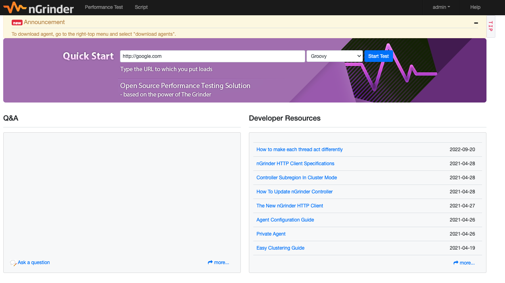
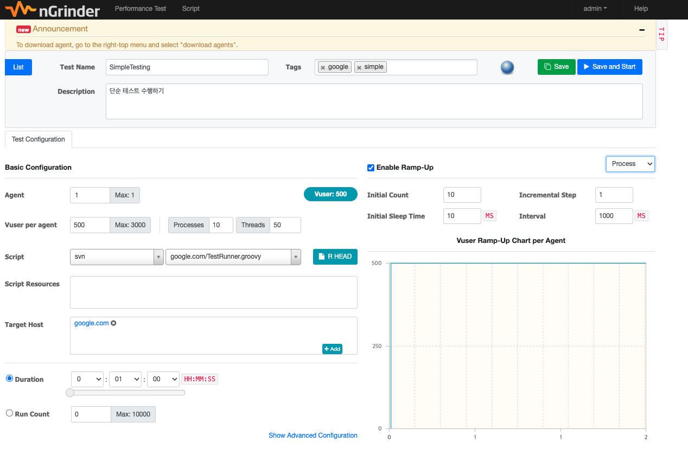
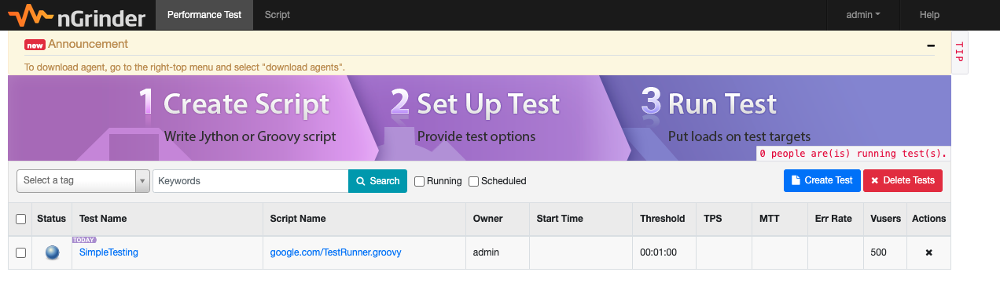
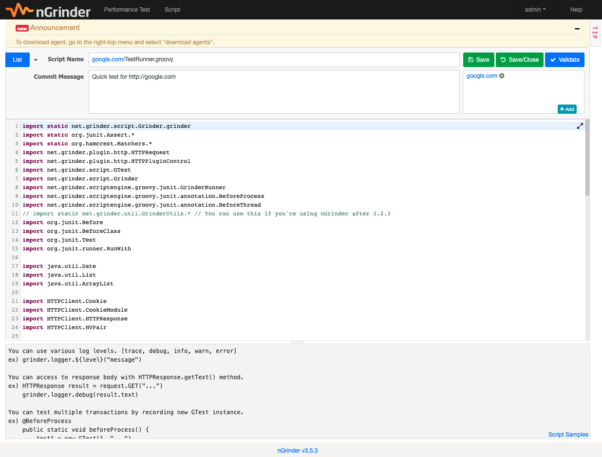
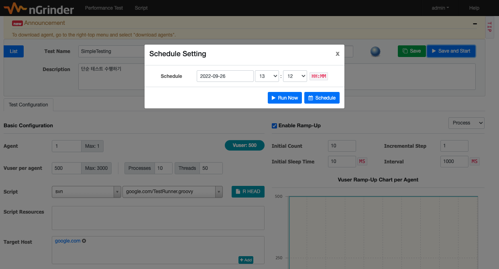
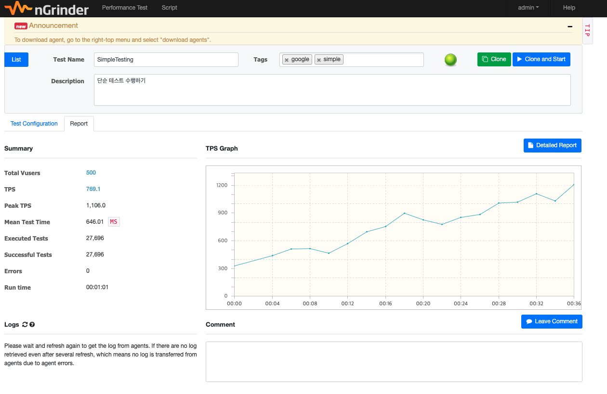
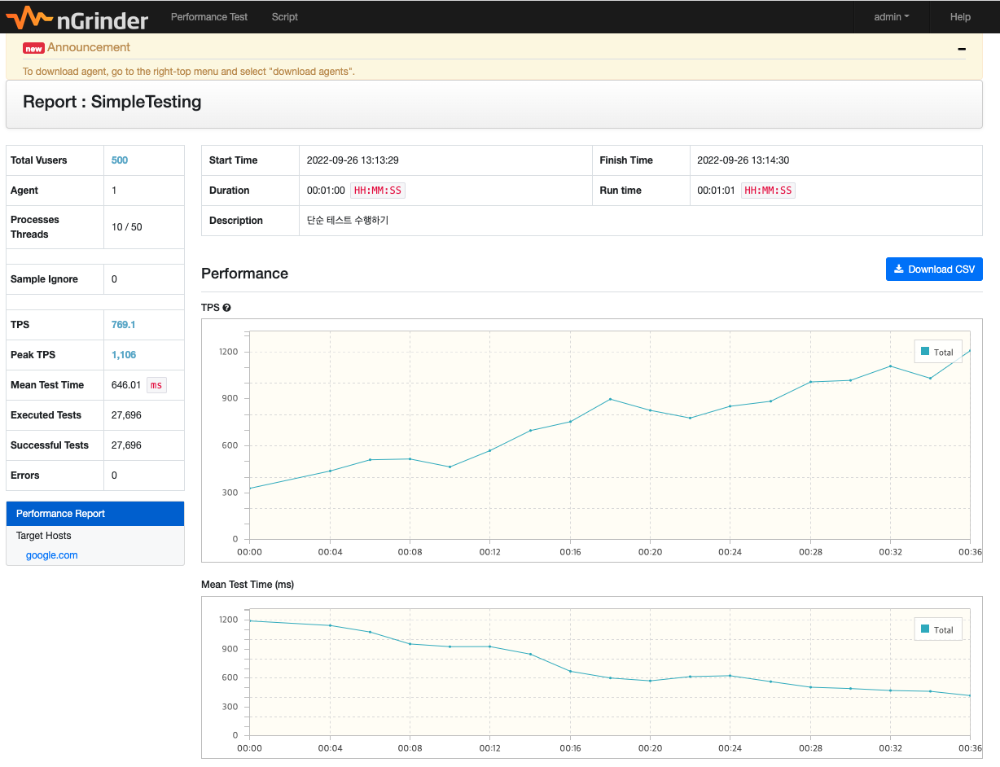
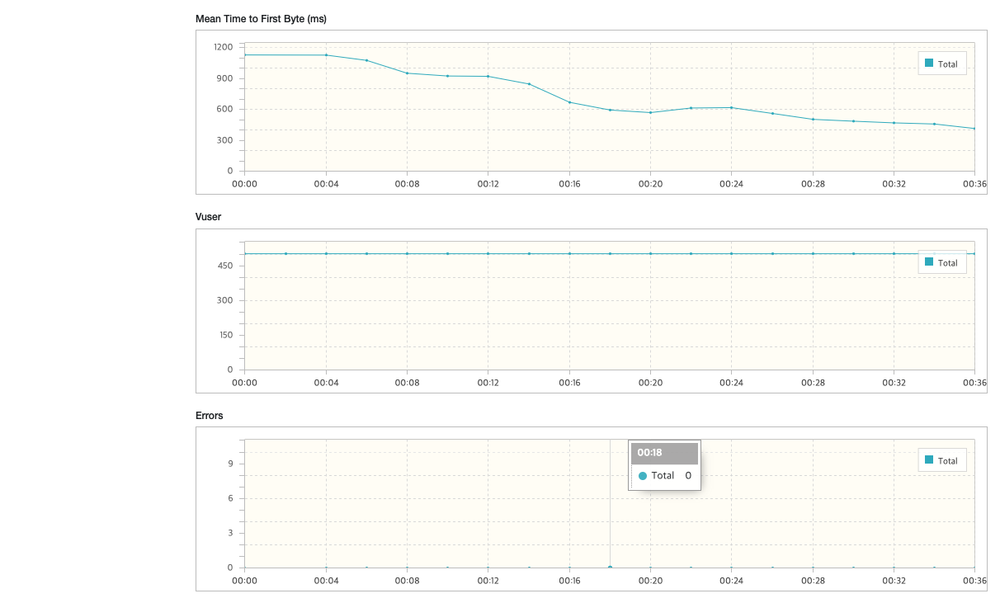

# nGrinder 사용하기 

## nGrinder Architecture 이해하기 


- from: https://github.com/naver/ngrinder/wiki/Architecture

- nGrinder는 여러 머신에서 jython 으로 작성된 스크립트를 실행할 수 있다. 
- 내부 엔진은 Grinder를 기반으로 한다. 
- nGrinder는 Grinder의 콘솔과 에이전트를 각각 컨트롤러와 에이전트로 감싸고 여러 기능을 확장하여 동시 테스트를 가능하게 한다. 

- 컴포넌트
  - Controller
    - 성능 테스트를 위한 웹 인터페이스를 제공
    - 테스트 프로세스들을 조율하여 테스트를 생성하고, 실행, 결과 수집, 뷰 등을 수행할 수 있다. 
  - Agent
    - process와 thread를 실행하여 로드를 대상 시스템에 주입하는 역할을 한다. 
    - 대상 시스템의 성능을 모니터링 (CPU/Memory) 한다. 

## Controller Perf 구성하기 

- AWS Amazon Linux 2 를 하나 준비한다. 

### Docker 설치 

- amazon linux ec2에 접근한다. 

```go
$ sudo yum update
$ sudo yum search docker
$ sudo yum info docker 
$ sudo yum install docker
```

- yum을 업데이트 --> docker 패키지 확인 --> docker 버젼 확인 
- 그리고 최종적으로 docker을 설치한다. 

### sudo 명령어 없이 docker 실행을 위한 설정 

```go
$ sudo usermod -a -G docker ec2-user
$ id ec2-user
$ newgrp docker
```

### docker-compose 사용의 경우 다음 커맨드 실행하기. 

```go
$ sudo yum install python3-pip
$ sudo pip3 install docker-compose
$ pip3 install --user docker-compose
```

## boot 시 docker 자동실행 설정 

```go
$ sudo systemctl enable docker.service
$ sudo systemctl start docker.service
```

- 이후 로그아웃 했다가 다시 ec2-user 로 접근한다. 그리고 버젼확인 

```go
$ docker version
```

## nGrinder 를 docker 로 수행하기. 

- from: https://github.com/naver/ngrinder/blob/develop/docker/README.md

### Controller 실행하기 

```go
$ docker pull ngrinder-controller:3.5.3
```

```go
docker run -d -v ~/ngrinder-controller:/opt/ngrinder-controller -p 80:80 -p 16001:16001 -p 12000-12009:12000-12009 ngrinder-controller:3.4

```

### Agent 설치하기 

```go
$ docker pull ngrinder/agent:3.5.3
$ docker run -v ~/ngrinder-agent:/opt/ngrinder-agent -d ngrinder/agent:3.4 controller_ip:controller_web_port

```

- 위와같이 controller_ip에는 controller 서버의 ip를 입력한다. 
- controller_web_port 에는 controller 서버의 포트번호를 입력한다.

### nGrinder 콘솔화면 살펴보기 


- ID: admin
- PWD: admin 



- Quick Start: http://google.com 을 입력하고 "Start test" 버튼을 클릭한다. 



- Test Name: SimpleTesting
- Tags: google, simple
- Description: 단순테스트 수행하기
- Agent: 1
- Vuser: 500
  - vuser는 agent * processes * threads 로 계산된다. 
- Script: 자동으로 생성된 스크립트가 지정된다. 
- Duration: 테스트가 수행되는 시간, 기본 1분으로 지정됨 
- Enable Ramp-Up: 램프업 기능 설정
  - Initial Count: 초기 vUser수를 지정한다. 시작하자마자 한번에 대상 서버에 붙을 vuser를 지정한다. 
  - Incremental Step: 매번 증가할 스텝 지정 (여기서는 1로 지정), 매번 vuser 가 1씩 증가한다. 
  - Initial Sleep Time: 처음 vUser가 실행될때 초기 휴식타임
  - Interval: 스텝 인터벌 시간: 기본 1초

- "Save" 버튼을 클릭하여 테스트 정보를 저장한다. 
  


- 위와 같이 테스트 목록을 확인할 수 있다. 
  


- 위 화면은 테스트 스크립트이다. 
- 테스트 스크립트는 groovy 언어로 작성되어 있으며, 해당 스크립트를 수정하여 다양한 테스트 시나리오를 수행할 수 있다. 

## 테스트 코드 확인하기 

- 테스트 정보에서 "R HEAD" 버튼을 클릭하면 다음과 같이 확인할 수 있다. 
  
```java
import static net.grinder.script.Grinder.grinder
import static org.junit.Assert.*
import static org.hamcrest.Matchers.*
import net.grinder.plugin.http.HTTPRequest
import net.grinder.plugin.http.HTTPPluginControl
import net.grinder.script.GTest
import net.grinder.script.Grinder
import net.grinder.scriptengine.groovy.junit.GrinderRunner
import net.grinder.scriptengine.groovy.junit.annotation.BeforeProcess
import net.grinder.scriptengine.groovy.junit.annotation.BeforeThread
// import static net.grinder.util.GrinderUtils.* // You can use this if you're using nGrinder after 3.2.3
import org.junit.Before
import org.junit.BeforeClass
import org.junit.Test
import org.junit.runner.RunWith

import java.util.Date
import java.util.List
import java.util.ArrayList

import HTTPClient.Cookie
import HTTPClient.CookieModule
import HTTPClient.HTTPResponse
import HTTPClient.NVPair

/**
 * A simple example using the HTTP plugin that shows the retrieval of a
 * single page via HTTP. 
 * 
 * This script is automatically generated by ngrinder.
 * 
 * @author admin
 */
@RunWith(GrinderRunner)
class TestRunner {

	public static GTest test
	public static HTTPRequest request
	public static NVPair[] headers = []
	public static NVPair[] params = []
	public static Cookie[] cookies = []

	@BeforeProcess
	public static void beforeProcess() {
		HTTPPluginControl.getConnectionDefaults().timeout = 6000
		test = new GTest(1, "google.com")
		request = new HTTPRequest()
		grinder.logger.info("before process.");
	}

	@BeforeThread 
	public void beforeThread() {
		test.record(this, "test")
		grinder.statistics.delayReports=true;
		grinder.logger.info("before thread.");
	}
	
	@Before
	public void before() {
		request.setHeaders(headers)
		cookies.each { CookieModule.addCookie(it, HTTPPluginControl.getThreadHTTPClientContext()) }
		grinder.logger.info("before. init headers and cookies");
	}

	@Test
	public void test(){
		HTTPResponse result = request.GET("http://google.com", params)

		if (result.statusCode == 301 || result.statusCode == 302) {
			grinder.logger.warn("Warning. The response may not be correct. The response code was {}.", result.statusCode); 
		} else {
			assertThat(result.statusCode, is(200));
		}
	}
}

```

- @BeforeProcess: 
  - 프로세스가 수행되기 전에 실행된다. 
  - 프로세스 마다 1번만 수행 
  - 초기 커넥션 타임, 테스트 대상 생성, 요청 객체 생성 
- @BeforeThread 
  - thread 를 수행하기 전에 실행된다.
  - 스레드마다 1번만 수행
  - test.record 로 테스트 정보를 저장하도록 한다. 
- @Before
  - 테스트를 수행하기 전에 실행된다. 매 요청을 보내기 전에 수행된다. 
  - 요청 객체 생성 및 요청 호출 
  - 요청 처리 결과가 정상인지 검사한다. assertThat(result.statusCode, is(200)) 은 결과값이 200으로 정상인지 확인하게 된다. 

### 간략 사용법 

- 스크립트 아래 다음과 같은 간략한 테스트 코드 작성법이 있다. 
- 자세한 코드 작성 샘플은 https://github.com/naver/ngrinder/tree/master/script-sample 에서 확인하자. 
  
```go
다양한 로그 레벨을 다음과 같이 설정한다.  [trace, debug, info, warn, error]
ex) grinder.logger.${level}("message")

HTTPResponse.getText() 메소드로 응답 컨텐츠에 접근할 수 있다. 
ex) HTTPResponse result = request.GET("...")
    grinder.logger.debug(result.text)

새로운 GTest 인스턴스 에 의해서 복수개의 트랜잭션을 테스트할 수 있다. 
ex) @BeforeProcess
    public static void beforeProcess() {
        test1 = new GTest(1, "...")
        test2 = new GTest(2, "...")
    }

    @BeforeThread
    public void beforeThread() {
        test1.record(this, "test1")
        test2.record(this, "test2")
    }

    @Test
    public void test1() { ... }

    @Test
    public void test2() { ... }

@RunRate 어노테이션을 이용하여 테스트 실행 비율을 지정할 수 있다. 
ex) import net.grinder.scriptengine.groovy.junit.annotation.RunRate

    @Test
    @RunRate(50)
    public void test() { ... } // 이 테스트는 지정한 총 실행의 절반만 실행된다. 


Script Samples
nGrinder v3.5.3
```

## 테스트 수행하기 

- 위 생성한 테스트를 실행햅자. 
- Performance Test에서 조금전 생성한 SimpleTesting 을 클릭한다. 
- 이후 "Save and Start" 를 클릭하여 테스트를 수행한다. 



- 위와 같은 창이 나오면 "Run now" 버튼으로 바로 실행하자. 
- 예약 실행을 원한다면 예약 시간을 설정하여 테스트하면 된다. 

### 테스트 요약 정보 



- 테스트를 수행하면 테스트 요약 정보를 확인할 수 있다. 
- Total vUsers: 500
  - 총 가상 유저가 500임을 알 수 있다. 
- TPS: 769.1
  - Transaction Per Second로 초당 처리량이다. 769.1 이 나왔다.
- Peak TPS: 1,106
  - 최대 피크 TPS
- Mean Test Time: 646.01
  - 평균 응답시간이 0.6초 정도 소요되었음을 알 수 있다. (밀리초로 출력된다.)
- Executed Tests: 27,696
  - 실행된 총 테스트수
- Successful Tests: 27,696
  - 성공한 총 테스트수
- Errors: 0
  - 에러수
- Run Time: 1분 1초
  - 테스트 수행시간 

<br/>

- 그래프와 같이 시간이 지남에 따라 vUser가 증가되며, TPS도 사용자 수만큼 상승함을 확인할 수 있다. 
- 이후 특정 시간이 지나면 사용자가 늘어도 응답 시간이 동일한 Saturation 구간이 생기며, 이때를 포화상태 라고 한다. 

### Detailed Report 확인하기 

- 이제 Detailed Report 를 확인하자. 



- Total Vusers: 총 가상유저
- Agent: 1 (1개의 에이전트 수행)
- Processes Threads: 쓰레드는 10/50 으로 수행됨
<br/>
- TPS: 총 TPS
- Peak TPS: 최대 TPS
- Mean Test Time: 평균 응답시간
- Executed Tests: 실행된 테스트수
- Successful Tests: 성공한 테스트 수
- Errors: 에러 카운트 
<br/>
- Start Time: 시작시간
- Finish Time: 종료시간
- Duration: 테스트 기간
- Run time: 실 수행시간
- Description: 설명 



### Performance 지표 

- TPS: 성능 지표 그래프를 확인할 수 있다. 시간이 지나고, vuser가 증가하면서 TPS가 계속해서 증가하고 있다. (샘플 테스트가 아니라면 테스트 기간을 더 늘여서 포화구간까지 갈 필요가 있다.)
- Mean Test Time: 평균 테스트 타임 (평균 응답시간)
- Mean Time to First Byte(ms): 첫 바이트가 오기까지의 평균 응답시간 
- Vuser: 가상 유저수 (500으로 확인됨)
- Errors: 에러 수에 대한 그래프 

## Wrap Up

- 지금까지 nGrinder의 사용법을 확인해 보았다. 
- 일반적으로 1대의 Agent에서 3000 유저의 트래픽을 보내게 된다. 
- 더 많은 트래픽을 위해서는 Agent를 추가로 더 붙여서 테스트를 수행하자. 
- 기본적으로 대상 시스템의 정보는 Datadog 혹은 CloudWatch 등과 같은 메트릭 시스템을 함께 보면서 nGrinder가 보여주는 TPS, 응답시간, 에러율을 확인하고, 이 시점에 메트릭은 어떻게 보이는지 (CPU, Memory, Network 속도) 등을 확인하면서 성능을 측정한다. 
