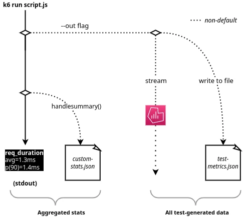

# K6

- Grafana k6는 오픈소스 부하 테스팅 툴이다. 
- 성능 테스트를 쉽게 수행할 수 있고, 엔지니어링 팀의 생산성을 향상 시킨다. 

- k6를 이용하면 신뢰성 있고, 시스템의 성능테스트를 수행할 수 있다. 
- 이를 통해 성능을 측정하고, 문제를 쉽게 해결할 수 있는 초석이 된다. 

## Use Cases

- k6 사용자는 일반적인 개발자들, QA 엔지니어, SDET, SRE 등이 대상이다. 
- k6를 이용하면 API, microservices, website를 통해서 성능, 신뢰성 테스트를 수행할 수 있다. 
  - Load testing
    - k6는 최소한 리소스를 소비하기 위해 최적화되어 있고, 높은 로드 테스트를 수행하는 목적으로 사용한다. (spike, stress, soak tests)
  - Performance and synthetic monitoring
    - k6 를 통해서 작은 양의 로드를 지속적으로 주입하고, 제품 환경의 성능, 가용성등을 테스트할 수 있다. 
  - Chaos and reliability testing
    - k6 는 확장가능한 아키텍처이다. 
    - k6를 이용하여 카오스 엔지니어링의 트래픽 시뮬레이션 파트를 수행하거나, k6테스트로 트리거링 할 수 있다. 

## 로드 테스팅 메니페스토

- 로드 테스트 메니페스토는 성능, 로드테스팅을 깊이있게 수행한 결과이다. 
- 성능 테스트를 올바르게 수행하기 위한 가이드를 다음과 같이 제공한다. 
  - [Simple testing is better than no testing](https://k6.io/our-beliefs/#simple-testing-is-better-than-no-testing)
  - [Load testing should be goal oriented](https://k6.io/our-beliefs/#load-testing-should-be-goal-oriented)
  - [Load testing by developers](https://k6.io/our-beliefs/#load-testing-by-developers)
  - [Developer experience is super important](https://k6.io/our-beliefs/#developer-experience-is-super-important)
  - [Load test in a pre-production environment](https://k6.io/our-beliefs/#load-test-in-a-pre-production-environment)

## K6가 수행하지 못하는것

- k6는 고성능 로드테스트 툴이며, 자바스크립트로 스크립팅 할 수 있다. 
- 이러한 이점을 가져오기 위해서 트레이드 오프한 내용이 있다. 
  - 브라우저에서 네이트브하게 수행할 수 없다.
    - 기본적으로 k6는 웹 페이지를 브라우저와 같은 방법으로 렌더링할 수없다. 
    - 브라우저들은 시스템 리소스를 많이 사용한다. 
    - 브라우저가 빠지면 단일 기기에서 더 많은 로드를 실행할 수 있다. 
    - 그러나 k6-browser를 사용하면 실제 브라우저와 상호작용하고 k6 테스트 일부로 프런트엔드 메트릭을 수집할 수 있다. 
  - NodeJS 에서 수행되지 않는다. 
    - Javascript 는 고성능을 위한 슈트로 사용하기에 적합하지 않다. 
    - 최대 성능을 획득하기 위해서 툴은 Go로 작성되어 있고, Javascript 런타임을 임베딩하여 쉽게 테스트를 수행할 수 있게 되어 있다. 

## 설치 

- k6는 리눅스, Mac, Window를 지원한다. 
- Docker 컨테이너로 실행할 수도 있다. 

### Linux

- Debian/Ubuntu

```go
sudo gpg --no-default-keyring --keyring /usr/share/keyrings/k6-archive-keyring.gpg --keyserver hkp://keyserver.ubuntu.com:80 --recv-keys C5AD17C747E3415A3642D57D77C6C491D6AC1D69
echo "deb [signed-by=/usr/share/keyrings/k6-archive-keyring.gpg] https://dl.k6.io/deb stable main" | sudo tee /etc/apt/sources.list.d/k6.list
sudo apt-get update
sudo apt-get install k6
```

- Fedora/CentOS
  - dnf 를 이용하거나 혹은 yum 을 이용할 수 있다. 

```go
sudo dnf install https://dl.k6.io/rpm/repo.rpm
sudo dnf install k6
```

### MacOS

- homebrew 를 이용하여 설치

```go
brew install k6
```

### Docker

```go
docker pull grafana/k6
```

## 기타

- binary: https://github.com/grafana/k6/releases
- k6 extension: https://k6.io/docs/extensions

## K6 실행하기

- 1. 테스트 실행하기
- 2. virtual user 추가하기
- 3. 테스트 기간 증가
- 4. 테스트를 수행하기 위해서 요청을 램프업/다운 한다. 

### 로컬 테스트 수행하기

- 단순 로컬 스트립트 작성하기
- 1. script.js 파일을 생성하여 다음과 같이 기본 코드를 작성한다. 

```js
import http from 'k6/http';
import { sleep } from 'k6';

export default function () {
  http.get('https://test.k6.io');
  sleep(1);
}
```

- 2. k6 커맨드를 실행한다. 

```go
$ k6 run script.js
```

```docker
docker run --rm -i grafana/k6 run - <script.js
```

-- 실행결과

```go

          /\      |‾‾| /‾‾/   /‾‾/   
     /\  /  \     |  |/  /   /  /    
    /  \/    \    |     (   /   ‾‾\  
   /          \   |  |\  \ |  (‾)  | 
  / __________ \  |__| \__\ \_____/ .io

  execution: local
     script: script.js
     output: -

  scenarios: (100.00%) 1 scenario, 1 max VUs, 10m30s max duration (incl. graceful stop):
           * default: 1 iterations for each of 1 VUs (maxDuration: 10m0s, gracefulStop: 30s)


running (00m02.6s), 0/1 VUs, 1 complete and 0 interrupted iterations
default ✓ [======================================] 1 VUs  00m02.6s/10m0s  1/1 iters, 1 per VU

     data_received..................: 17 kB 6.5 kB/s
     data_sent......................: 438 B 168 B/s
     http_req_blocked...............: avg=1.4s     min=1.4s     med=1.4s     max=1.4s     p(90)=1.4s     p(95)=1.4s    
     http_req_connecting............: avg=186.01ms min=186.01ms med=186.01ms max=186.01ms p(90)=186.01ms p(95)=186.01ms
     http_req_duration..............: avg=193.72ms min=193.72ms med=193.72ms max=193.72ms p(90)=193.72ms p(95)=193.72ms
       { expected_response:true }...: avg=193.72ms min=193.72ms med=193.72ms max=193.72ms p(90)=193.72ms p(95)=193.72ms
     http_req_failed................: 0.00% ✓ 0        ✗ 1  
     http_req_receiving.............: avg=564µs    min=564µs    med=564µs    max=564µs    p(90)=564µs    p(95)=564µs   
     http_req_sending...............: avg=69µs     min=69µs     med=69µs     max=69µs     p(90)=69µs     p(95)=69µs    
     http_req_tls_handshaking.......: avg=204.18ms min=204.18ms med=204.18ms max=204.18ms p(90)=204.18ms p(95)=204.18ms
     http_req_waiting...............: avg=193.08ms min=193.08ms med=193.08ms max=193.08ms p(90)=193.08ms p(95)=193.08ms
     http_reqs......................: 1     0.384254/s
     iteration_duration.............: avg=2.6s     min=2.6s     med=2.6s     max=2.6s     p(90)=2.6s     p(95)=2.6s    
     iterations.....................: 1     0.384254/s
     vus............................: 1     min=1      max=1
     vus_max........................: 1     min=1      max=1
```

### Vuser 추가하기 

- 이제 더 많은 유저와 더 오래동안 테스트를 수행하자. 
- 아래 내용은 30초동안 10vuser 로드 테스트를 수행한다. 
  
```go
$ k6 run --vus 10 --duration 30s script.js
```

```go
$ docker run --rm -i grafana/k6 run --vus 10 --duration 30s - <script.js
```

- k6 는 가상유저(vuser) 의 개념을 도입하였다. 
- VU는 병렬 루프로 동작한다. 
- 스크립트들은 JavaScript 로 작성 되었고, ES6 모듈로 동작한다. 
- 이를 통해 더 큰 테스트를 더 작은 조각으로 나누거나 원하는 대로 재사용 가능한 조각을 만들 수 있다. 

- 실행결과

```go
     data_received..................: 2.8 MB 90 kB/s
     data_sent......................: 27 kB  857 B/s
     http_req_blocked...............: avg=59.91ms  min=9.16µs   med=53.68µs  max=1.42s    p(90)=168.38µs p(95)=911.08µs
     http_req_connecting............: avg=8.4ms    min=0s       med=0s       max=209.94ms p(90)=0s       p(95)=0s      
     http_req_duration..............: avg=229.01ms min=189.39ms med=207.35ms max=424.6ms  p(90)=377.37ms p(95)=395.72ms
       { expected_response:true }...: avg=229.01ms min=189.39ms med=207.35ms max=424.6ms  p(90)=377.37ms p(95)=395.72ms
     http_req_failed................: 0.00%  ✓ 0        ✗ 238 
     http_req_receiving.............: avg=24.66ms  min=161.95µs med=1.14ms   max=213.93ms p(90)=184.83ms p(95)=192.32ms
     http_req_sending...............: avg=441.45µs min=28.91µs  med=226.66µs max=6.82ms   p(90)=549.87µs p(95)=1.44ms  
     http_req_tls_handshaking.......: avg=13.74ms  min=0s       med=0s       max=336.07ms p(90)=0s       p(95)=0s      
     http_req_waiting...............: avg=203.91ms min=187.06ms med=203.2ms  max=422.79ms p(90)=211.52ms p(95)=215.54ms
     http_reqs......................: 238    7.634791/s
     iteration_duration.............: avg=1.29s    min=1.19s    med=1.2s     max=2.66s    p(90)=1.39s    p(95)=1.41s   
     iterations.....................: 238    7.634791/s
     vus............................: 4      min=4      max=10
     vus_max........................: 10     min=10     max=10
```

- 위와 같이 vus 가 max=10 으로 확인할 수 있다. 

### 옵션 이용하기

- 실행 파라미터로 vuser와 durations 를 입력했었다. 
- 그러나 스크립트 소스에서 옵션으로 이를 정의할 수 있다. 

```js
import http from 'k6/http';
import { check, sleep } from 'k6';

export const options = {
  stages: [
    { duration: '30s', target: 20 },
    { duration: '1m30s', target: 10 },
    { duration: '20s', target: 0 },
  ],
};

export default function() {
  const res = http.get('https://httpbin.test.k6.io/');
  check(res, { 'status was 200': (r) => r.status === 200 });
  sleep(1)
}
```

- 위 내용은 램핑 시나리오를 작성한 것이다. 
  - vuser 20 을 서서히 30초 동안 생성한다. 램프업 
  - vuser 10 의 사람이 1분 30초 동안 로드를 주입한다.
  - vuser 가 0이 되도록 20초동안 램프 백 다운을 한다. 

#### 실행하기 

```go
$ docker run --rm -i grafana/k6 run - < script_with_options.js
```

- 결과보기

```go
     checks.........................: 100.00% ✓ 1494      ✗ 0   
     data_received..................: 15 MB   105 kB/s
     data_sent......................: 167 kB  1.2 kB/s
     http_req_blocked...............: avg=7.93ms   min=9.75µs   med=55.43µs  max=1.61s    p(90)=119.14µs p(95)=226.11µs
     http_req_connecting............: avg=3.34ms   min=0s       med=0s       max=221.48ms p(90)=0s       p(95)=0s      
     http_req_duration..............: avg=204.54ms min=189.32ms med=202.06ms max=423.05ms p(90)=213.07ms p(95)=215.72ms
       { expected_response:true }...: avg=204.54ms min=189.32ms med=202.06ms max=423.05ms p(90)=213.07ms p(95)=215.72ms
     http_req_failed................: 0.00%   ✓ 0         ✗ 1494
     http_req_receiving.............: avg=3.39ms   min=177.12µs med=2.21ms   max=208.15ms p(90)=5.44ms   p(95)=6.92ms  
     http_req_sending...............: avg=335.11µs min=33.5µs   med=234.83µs max=5.9ms    p(90)=539.63µs p(95)=818.63µs
     http_req_tls_handshaking.......: avg=3.72ms   min=0s       med=0s       max=297.72ms p(90)=0s       p(95)=0s      
     http_req_waiting...............: avg=200.81ms min=187.95ms med=198.96ms max=256.28ms p(90)=209.97ms p(95)=211.75ms
     http_reqs......................: 1494    10.586208/s
     iteration_duration.............: avg=1.21s    min=1.19s    med=1.2s     max=2.83s    p(90)=1.21s    p(95)=1.22s   
     iterations.....................: 1494    10.586208/s
     vus............................: 1       min=1       max=20
     vus_max........................: 20      min=20      max=20
```

## 결과 출력하기

- k6 는 테스트 결과를 확인하는 2가지 옵션을 제공한다. 
  - 표준 출력으로 결과를 전달한다. 
  - 더 상세한 분석및 시계열 데이터 분석을 수행하기 우해서 외부 출력을 위한 스트림밍 할 수 있다. 



- 기본적으로 테스트가 끝나면 테스트 써러미 리포트를 제공한다. 
- 테스트 결과의 집계를 리포트하며 여기에는 groups, checks, threshold 에 대한 정보를 확인할 수 있다. 
- 기본결과로 통계역시 확인할 수 있으며 평균, 중앙값, 95분위수 등이 나온다. 

- 더 자세한 분석을 위해서는 외부로 결과를 출력한다. 
- 이 출력은 구조화된 파일 포맷이며 CSV, JSON 과 같은 형식으로 내보낼 수 있다. 
- 그러나 Datadog 또는 Prometheus 와 같은 다른 프로그램으로 스트리밍하거나 결과를 관리형 k6 클라우드 서비스로 파이프할 수 있다. 

### 표준 출력 

```go

          /\      |‾‾| /‾‾/   /‾‾/   
     /\  /  \     |  |/  /   /  /    
    /  \/    \    |     (   /   ‾‾\  
   /          \   |  |\  \ |  (‾)  | 
  / __________ \  |__| \__\ \_____/ .io

  execution: local
     script: -
     output: -

  scenarios: (100.00%) 1 scenario, 20 max VUs, 2m50s max duration (incl. graceful stop):
           * default: Up to 20 looping VUs for 2m20s over 3 stages (gracefulRampDown: 30s, gracefulStop: 30s)

     ✓ status was 200

     checks.........................: 100.00% ✓ 1494      ✗ 0   
     data_received..................: 15 MB   105 kB/s
     data_sent......................: 167 kB  1.2 kB/s
     http_req_blocked...............: avg=7.93ms   min=9.75µs   med=55.43µs  max=1.61s    p(90)=119.14µs p(95)=226.11µs
     http_req_connecting............: avg=3.34ms   min=0s       med=0s       max=221.48ms p(90)=0s       p(95)=0s      
     http_req_duration..............: avg=204.54ms min=189.32ms med=202.06ms max=423.05ms p(90)=213.07ms p(95)=215.72ms
       { expected_response:true }...: avg=204.54ms min=189.32ms med=202.06ms max=423.05ms p(90)=213.07ms p(95)=215.72ms
     http_req_failed................: 0.00%   ✓ 0         ✗ 1494
     http_req_receiving.............: avg=3.39ms   min=177.12µs med=2.21ms   max=208.15ms p(90)=5.44ms   p(95)=6.92ms  
     http_req_sending...............: avg=335.11µs min=33.5µs   med=234.83µs max=5.9ms    p(90)=539.63µs p(95)=818.63µs
     http_req_tls_handshaking.......: avg=3.72ms   min=0s       med=0s       max=297.72ms p(90)=0s       p(95)=0s      
     http_req_waiting...............: avg=200.81ms min=187.95ms med=198.96ms max=256.28ms p(90)=209.97ms p(95)=211.75ms
     http_reqs......................: 1494    10.586208/s
     iteration_duration.............: avg=1.21s    min=1.19s    med=1.2s     max=2.83s    p(90)=1.21s    p(95)=1.22s   
     iterations.....................: 1494    10.586208/s
     vus............................: 1       min=1       max=20
     vus_max........................: 20      min=20      max=20
```

- 위 결과는 표준 출력으로 리포팅한 것이다. 

#### Test 상세

```go
  execution: local
     script: -
     output: -

  scenarios: (100.00%) 1 scenario, 20 max VUs, 2m50s max duration (incl. graceful stop):
           * default: Up to 20 looping VUs for 2m20s over 3 stages (gracefulRampDown: 30s, gracefulStop: 30s)
```

- execution:
  - k6 실행 모드를 확인할 수 있다. local과 cloud 로 나타난다. 
- output:
  - 정교한 테스트 결과의 출력을 나타낸다. 
  - 기본적으로 출력은 없으므로 '-' 가 표시된다. 
  - 집계된 테스트 종료 요약만 표시된다. 
- script:
  - 수행된 스크립트 파일의 경로와 이름이 노출된다. 
- scenarios:
  - 시나리오의 상세를 나타낸다. 
  - 100%: 실행된 세그먼트의 실행율이다. 
  - 1 scenario: 시나리오 1이 수행되었음
  - 20 max VUs: 는 최대 20 VUser가 생성되어 실행했음을 알 수 있따. 
  - 2m50s max duration: 최대 로드 주입시간 (여기에는 graceful stop이 포함된다.)
  - * default: 이번 테스트에서 수행한 시나리오 설명이다. 
    - 이 케이스에서는 3단계에 걸쳐 2m20초 동안 최대 20개의 루핑 VU(gracefulRampDown: 30초, gracefulStop: 30초) 수행

#### End of test summary report

- 테스트 서머리는 테스트 결과의 일반적인 오버뷰를 제공한다. 
- 서머리는 기본적으로 표준 출력으로 출력된다. 
  - 출력되는 정보는 내장 메트릭과 커스텀 메트릭이 출력된다. 
  - Checks(테스트 성공여부) 와 Threshold(테스트 종료 조건정보) 정보 를 노출한다. 
  - Groups and Tags

```go
     checks.........................: 100.00% ✓ 1494      ✗ 0   
     data_received..................: 15 MB   105 kB/s
     data_sent......................: 167 kB  1.2 kB/s
     http_req_blocked...............: avg=7.93ms   min=9.75µs   med=55.43µs  max=1.61s    p(90)=119.14µs p(95)=226.11µs
     http_req_connecting............: avg=3.34ms   min=0s       med=0s       max=221.48ms p(90)=0s       p(95)=0s      
     http_req_duration..............: avg=204.54ms min=189.32ms med=202.06ms max=423.05ms p(90)=213.07ms p(95)=215.72ms
       { expected_response:true }...: avg=204.54ms min=189.32ms med=202.06ms max=423.05ms p(90)=213.07ms p(95)=215.72ms
     http_req_failed................: 0.00%   ✓ 0         ✗ 1494
     http_req_receiving.............: avg=3.39ms   min=177.12µs med=2.21ms   max=208.15ms p(90)=5.44ms   p(95)=6.92ms  
     http_req_sending...............: avg=335.11µs min=33.5µs   med=234.83µs max=5.9ms    p(90)=539.63µs p(95)=818.63µs
     http_req_tls_handshaking.......: avg=3.72ms   min=0s       med=0s       max=297.72ms p(90)=0s       p(95)=0s      
     http_req_waiting...............: avg=200.81ms min=187.95ms med=198.96ms max=256.28ms p(90)=209.97ms p(95)=211.75ms
     http_reqs......................: 1494    10.586208/s
     iteration_duration.............: avg=1.21s    min=1.19s    med=1.2s     max=2.83s    p(90)=1.21s    p(95)=1.22s   
     iterations.....................: 1494    10.586208/s
     vus............................: 1       min=1       max=20
     vus_max........................: 20      min=20      max=20
```

- 메트릭은 다음 참조: https://k6.io/docs/using-k6/metrics

#### Trend metrics

- 트랜드 메트릭은 트랜드(추이) 통계의 집계정보이다. 
- min/max/avg/percentiles 등에 대한 시리즈 값이다. 

```go
     http_req_receiving.............: avg=3.39ms   min=177.12µs med=2.21ms   max=208.15ms p(90)=5.44ms   p(95)=6.92ms  
```

- 트랜드 메트릭의 출력 값을 바꾸고 싶은경우 summaryTrendStats 옵션을 이용할 수 있다. 

```go
$ k6 run --summary-trend-stats="min,avg,med,p(99),p(99.9),max,count" --summary-time-unit=ms  script.js
```

#### 써머리 export 하기 

- 기계가 읽을 수 있는 형식으로 테스트 수행 결과를 출력할 수 있다. 
- 예를 들어 리포트를 JSON 파일로 내보내거나 할 수 있다. 
- 이는 대시보드나 외부 알림 등으로 사용도 가능하다. 

- handleSummary() 콜백을 이용하는 것을 권장하며 https://k6.io/docs/results-visualization/end-of-test-summary#handlesummary-callback 에서 찾아볼 수 있다. 
- 포맷 형식은 JSON, CSV, XML(JUnit/xUnit등), HTML, TXT 등이 된다. 
- 혹은 --summary-export 라는 옵션을 이용할 수 있다. (현재는 사용하지 않는 것으로 권장하고 있다.)

### 외부 출력 

- 출력 결과를 visualize 하기 위해서 결과 정보를 내보낼 수 있다. 
- --out 플래그를 이용하여 원하는 대상을 지정할 수 있다. 

```go
k6 run --out statsd script.js
```

- 가능한 출력 옵션
  - Amazon CloudWatch: https://k6.io/docs/results-visualization/amazon-cloudwatch
  - Cloud: https://k6.io/docs/results-visualization/cloud
  - CSV: https://k6.io/docs/results-visualization/csv
  - Datadog: https://k6.io/docs/results-visualization/datadog
  - Grafana Cloud: https://k6.io/docs/results-visualization/grafana-cloud
  - InfluxDB: https://k6.io/docs/results-visualization/influxdb-+-grafana
  - JSON: https://k6.io/docs/results-visualization/json
  - Netdata: https://k6.io/docs/results-visualization/netdata
  - Net Relic: https://k6.io/docs/results-visualization/new-relic
  - Prometheus: https://k6.io/docs/results-visualization/prometheus
  - TimescaleDB: https://k6.io/docs/results-visualization/timescaledb
  - StatsD: https://k6.io/docs/results-visualization/statsd

#### 복수 출력

```go
k6 run \
--out json=test.json \
--out influxdb=http://localhost:8086/k6
```

- 위와 같이 복수형태로 출력이 가능하다. 

## WrapUp

- k6는 Grafana에서 만든 오픈소스 부하테스트 도구이다. 
- 클라우드/로컬에서 수행할 수 있으며, 커맨드라인과 스트립트를 이용하여 부하를 주입하여, 기존 웹 베이스 부하테스터 혹은 어플리케이션 기반 부하테스터에 비해 가볍고, 더 많은 부하를 생성해 낼수 있는 장점이 있다.
- 간단한 스크립트 작성만으로 다양한 형태의 시나리오를 실행할 수 있다는 것도 확인했다. 

- ref: https://k6.io/docs/getting-started/installation/
