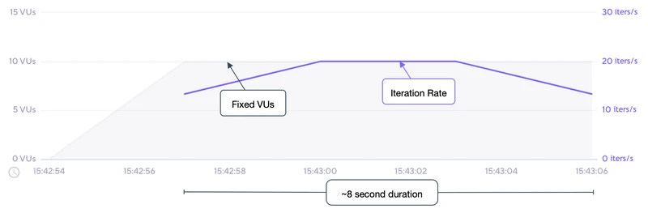

# Shared iterations

- 고정된 수의 반복이 여러 VU간에 "공유" 되며 모든 반복이 실행되면 테스트가 종료된다. 
- 이 실행기는 전역 vus 및 반복 바로가기 옵션과 동일하다. 

- 반복은 이 실행기로 공정하게 분산되지 않으며 더 빨리 실행되는 VU는 다른 것보다 더 많은 반복을 완료한다.
- 모든 VU가 고정된 특정 반복 횟수를 완료하도록 하려면 per-VU iteration executor를 사용하자. 

## Options

- 일반적인 구성 옵션 외에 이 실행 프로그램은 다음 옵션도 추가한다. 
- 일반적인 구성옵션: https://k6.io/docs/using-k6/scenarios#common-options

|OPTION|	TYPE|	DESCRIPTION|	DEFAULT|
|---|---|---|---|
|vus|	integer|	동시에 실행할 VU수|	1|
|iterations|	integer|	모든 VU 들이 수행할 스크립트 반복의 총 횟수 |	1|
|maxDuration|	string|	강제로 중지되기 전에 최대 시나리오 지속시간 (gracefulStop 제외)|	"10m"|

## When to use

- 이 실행기는 특정 양의 VU로 고정된 총 반복 횟수를 완료하고 VU당 반복 횟수가 중요하지 않을 때 적합하다. 
- 이것은 VU의 가장 효율적인 사용이 될 것이므로 여러 테스트 반복을 완료하는 데 걸리는 시간이 염려되는 경우 이 실행기가 최상의 성능을 발휘해야한다. 

- 예제에서 개발 중 빌드 주기의 일부로 빠른 성능테스트를 통합하는 것이 있다. 
- 개발자가 변경사항을 컴파일할 때 로컬 코드에 대해 테스트를 실행하여 성능 저하를 방지할 수 있다. 
- 이것은 "왼쪽으로 이동" 의 일부로 간주 된다. 수정 비용이 가장 낮은 개발 주기 초기에 성능에 더 중점을 둔다. 

## Example

- 이 예제에서는 최대 30초 동안 10개의 VU가 공유하는 총 200개의 반복을 실행한다. 

```js
import http from 'k6/http';
import { sleep } from 'k6';

export const options = {
  discardResponseBodies: true,
  scenarios: {
    contacts: {
      executor: 'shared-iterations',
      vus: 10,
      iterations: 200,
      maxDuration: '30s',
    },
  },
};

export default function () {
  http.get('https://test.k6.io/contacts.php');
  // 설명을 위한 목적으로만 처리 일시 중지를 삽입하고 있다. 
  // 각 반복은 ~512ms 가 될 것이다. 그러므로 각 VU 최대 처리량은 ~2 반복/초 이다.
  sleep(0.5);
}

```

## 관찰

- 다음 그래프는 예제 스크립트의 성능을 보여준다. 



- 테스트 시나리오 입력 및 결과를 기반으로
  - 테스트는 기본 function에 대해 고정된 200회 반복으로 제한된다. 
  - VU의 수는 10으로 고정되며 테스트가 시작되기 전에 초기화 된다. 
  - 기본 function의 각 반복은 대략 515ms 또는 ~2/s 가 될 것으로 예상된다. 
  - 최대 처리량(최고 효율)은 그러므로 ~20/s 이며 2 iter/s * 10 Vus의 결과이다. 
  - 테스트의 더 많은 부분에 대해 최대 처리량이 유지된다는 것을 알 수 있다. 
  - 8초 테스트 기간은 모든 executor 방법중 가장 짧다. 
  - 반복 분포가 왜곡될 수 있음을 알고 있다. 한 VU는 50회 반복을 수행한 반면 다른 VU는 10회만 수행했을 수 있다. 

