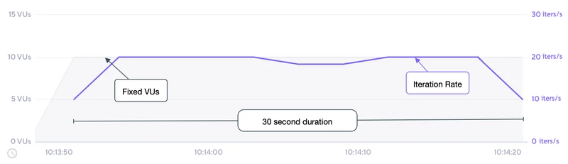

# Constant VUs

- 고정된 수의 VU는 지정된 시간 동안 가능한 많은 반복을 실행한다 
- 이 실행기는 전역 Vus 및 기간 옵션과 동일하다. 

## Options

- 일반적인 구성 옵션 외에 이 실행 프로그램은 다음 옵션도 추가한다. 
- 일반적인 구성옵션: https://k6.io/docs/using-k6/scenarios#common-options

|OPTION|	TYPE|	DESCRIPTION|	DEFAULT|
|---|---|---|---|
|duration(required)|	string|	총 시나리오 지속시간 (gracefulStop 제외)|	-|
|vus|	integer|	동시에 수행될 VU의 수 |	1|

## When to use

- 특정 시간 동안 실행하기 위해 특정 양의 VU가 필요한 경우 이 실행기를 사용하라. 

## Example

- 이 예제에서는 10VU가 30초 동안 지속적으로 수행된다. 

```js
import http from 'k6/http';
import { sleep } from 'k6';

export const options = {
  discardResponseBodies: true,
  scenarios: {
    contacts: {
      executor: 'constant-vus',
      vus: 10,
      duration: '30s',
    },
  },
};

export default function () {
  http.get('https://test.k6.io/contacts.php');
  // 설명 목적으로만 처리 일시 중지를 삽입하였다. 
  // 각 반복은 ~515ms 이므로 VU 최대 처리량당 ~2 반복/s 가 된다. 
  sleep(0.5);
}

```

## 관찰

- 다음 그래프는 예제 스크립트를 수행한 결과이다. 



- 테스트 시나리오 입력 및 결과를 기반으로 
  - VU의 수는 10으로 고정되어 있으며 테스트가 시작되기 전에 초기화 된다. 
  - 전체 테스트 기간은 구성된 30초 기간으로 고정된다. 
  - 기본 기능의 각 반복은 대략 515ms 또는 2/s 가 될 것으로 예상된다. 
  - 최대 처리량(최고 효율)은 ~20/s 로 2 iter/s * 10vus가 될 것이다. 
  - 대부분의 테스트에서 최대 처리량에 도달하고 유지되는 것을 볼 수 있다. 
  - 따라서 총 30초 * 20 iters/s 의 약 600번의 반복이 수행된다. 

