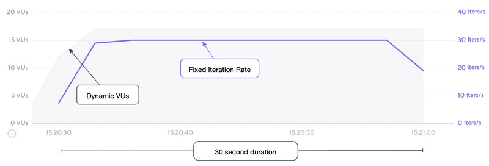

# Constant arrival rate

- 지정된 시간동안 고정된 수의 반복이 수행된다. 
- 이 실행기는 반복을 실행할 수 있는 VU가 있는 한 지정된 속도로 반복을 계속 시작한다. 
- 반복 실행 시간은 테스트 로직이나 테스트 중인 시스템이 더 느리게 응답하기 때문에 달라질 수 있다. 
- 이 실행기는 구성된 반복 속도를 충족하기 위해 테스트 중간에 더 많은 초기화를 포함하여 가변 수의 VU를 실행하여 보상을 시도한다. 
- 이 접근 방식은 예를 들어 RPS를 보다 정확하게 표현하는 데 유용하다. 

- 자세한 내용은 도착율 섹션을 참조하라. https://k6.io/docs/using-k6/scenarios/arrival-rate

## Options

- 일반적인 구성 옵션 외에 이 실행 프로그램은 다음 옵션도 추가한다. 
- 일반적인 구성옵션: https://k6.io/docs/using-k6/scenarios#common-options

|OPTION|	TYPE|	DESCRIPTION|	DEFAULT|
|---|---|---|---|
|duration(required)|	string|	총 시나리오 기간 (gracefulStop 제외)|	-|
|rate(required)|	integer|	각 timeUtil 기간 동안 시작할 반복 횟수이다. |	-|
|preAllocatedVUs(required)|	integer|	런타임 리소스를 보존하기 위해 테스트 시작 전에 미리 할당할 VU 수이다. |	-|
|timeUnit|	string|	요율 값을 적용하는 기간이다 .|	"1s"|
|maxVUs|	integer|	테스트 실행 중에 허용할 최대 VU 수이다 .|	설정되지 않은 경우 preAllocatedVU와 동일|

## When to use

- 테스트 중인 시스템의 성능에 영향을 받지 않고 일정한 수의 반복을 유지하려는 경우 

## Examples

- 이 예에서 우리는 30초 동안 초당 30번의 일정한 속도로 시작하여 k6이 최대 50개의 VU를 동적으로 예약할 수 있도록 했다. 

```js
import http from 'k6/http';
import { sleep } from 'k6';

export const options = {
  discardResponseBodies: true,
  scenarios: {
    contacts: {
      executor: 'constant-arrival-rate',

      // 테스트는 총 30초 동안 지속되어야 한다. 
      duration: '30s',

      //  timeUnit당 30번의 반복을 시작해야한다. 반복 시작점에 유의하라. 
      //  timeUnit 기간에 고르게 분산된다. 
      rate: 30,

      //  초당 rate 반복을 시작해야한다. 
      timeUnit: '1s',

      //  테스트를 시작하기 전에 2개의 VU를 미리 할당해야 한다. 
      preAllocatedVUs: 2,

      // 정의된 일정 도착율을 유지하기 위해 최대 50개의 VU를 회전할 수 있다. 
      maxVUs: 50,
    },
  },
};

export default function () {
  http.get('https://test.k6.io/contacts.php');
  // We're injecting a processing pause for illustrative purposes only!
  // Each iteration will be ~515ms, therefore ~2 iterations/second per VU maximum throughput.
  sleep(0.5);
}

```

- 참고: 고정된 요청 속도를 안정적으로 달성하려면 단일 요청 호출만 사용하고 추가 처리 또는 Sleep() 호출 없이 매우 간단하게 함수를 실행하는 것이 좋다. 

## 관찰

- 다음 그래프는 예제 스크립트의 성능을 보여준다. 



- 테스트 시나리오 입력 및 결과를 기반으로 
  - 1초마다 시작되는 30회 반복의 원하는 비율이 달성되고 대부분의 테스트 동안 유지된다. 
  - 테스트 시나리오는 지정된 30초 동안 실행된다. 
  - 2개의 VU(preAllocatedVUs 옵션으로 지정)로 시작한 k6은 VU 수을 자동으로 조정하여 최대 maxVU까지 원하는 비율을 달성한다.  테스트에서는 17VU로 끝났다. 
  - 정확히 900번의 반복 총 30초 * 30 반복으로 계산된다. 

- 이 예제에서와 같이 preAllocatedVUs 설정을 너무 낮게 사용하면 속도를 달성하기 위해 리소스를 지속적으로 할당해야 하므로 원하는 속도로 테스트 기간이 단축된다. 

