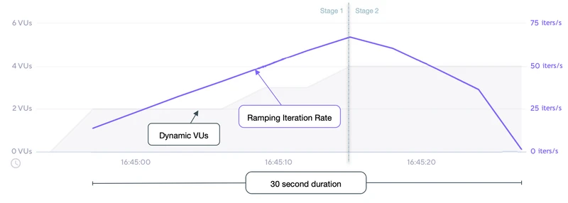

# Ramping arrival rate

- 지정된 기간 동안 다양한 수의 반복이 시작된다. 
- 이는 Ramping VU 실행기와 유사하지만 반복을 위한 것이다. 
- k6는 구성된 반복 속도를 달성하기 위해 VU 수를 동적으로 변경하려고 시도한다. 

## Options

- 일반적인 구성 옵션 외에 이 실행 프로그램은 다음 옵션도 추가한다. 
- 일반적인 구성옵션: https://k6.io/docs/using-k6/scenarios#common-options

|OPTION|	TYPE|	DESCRIPTION|	DEFAULT|
|---|---|---|---|
|stages(required)|	array|	증가 또는 감소할 대상 반복 횟수를 지정하는 객체의 배열이다. |	[]|
|preAllocatedVUs(required)|	integer|	런타임 리소스를 보존하기 위해 테스트 시작 전에 미리 할당할 VU 수이다. |	-|
|startRate|	integer|	테스트 시작 시 timeUnit 기간마다 실행할 반복 횟수 이다. |	0|
|timeUnit|	string|	단계의 대상 값에 startRate를 적용하는 기간이다. 그 값은 시나리오의 전체 기간 동안 일정하며 특정 단계에서는 변경할 수 없다. |	"1s"|
|maxVUs|	integer|	테스트 실행 중에 허용할 최대 VU 수이다.|	설정되지 않은경우 preAllocatedVUs와 동일해진다. |

## When to use

- 테스트가 테스트중인 시스템의 성능에 영향을 받지 않도록 해야 하고 특정 기간 동안 반복 횟수를 늘리거나 줄이려는 경우 

## Examples

- 이 예에서는 4단계 테스트를 수행한다. 
- 첫번째 1분동안 300회 반복을 시작하는 정의된 속도로 유지한다. 
- 그런다음 2분 동안 분당 300번에서 600번으로 반복 속도를 높이고 이 속도록 4분더 유지한다. 
- 마지막으로 지난 2분 동안 분당 60회 반복을 시작한다. 

```js
import http from 'k6/http';
import exec from 'k6/execution';

export const options = {
  discardResponseBodies: true,

  scenarios: {
    contacts: {
      executor: 'ramping-arrival-rate',

      //  timeUnit(예 분)당 300번의 반복 속도로 테스트를 시작했다. 
      startRate: 300,

      //  분당 'startRate' 반복을 시작해야 한다. 
      timeUnit: '1m',

      // 테스트를 시작하기 전에 2개의 VU를 미리 할당해야한다. 
      preAllocatedVUs: 2,

      // 정의된 일정한 도달률을 유지하기 위해 최대 50개의 VU를 회전할 수 있다. 
      maxVUs: 50,

      stages: [
        // 처음 1분 동안 'timeUnit' 당 300번의 반복을 시작해야한다. 
        { target: 300, duration: '1m' },

        // 다음 2분 동안 'timeUnit' 당 600회의 반복을 시작 하도록 선형으로 증가해야한다. 
        { target: 600, duration: '2m' },

        // 다음 4분 동안 'timeUnit' 당 600번의 반복을 계속 시작해야한다. 
        { target: 600, duration: '4m' },

        // 지난 기분 동안 'timeUnit' 당 60회 반복을 시작하도록 선형으로 감소해야 한다. 
        { target: 60, duration: '2m' },
      ],
    },
  },
};

export default function () {
  http.get('https://test.k6.io/contacts.php');
}

```

## 관찰 

- 다음 그래프는 예제 스크립트의 성능을 보여준다. 



- 테스트 시나리오의 입력 및 결과를 기반으로 
  - 총 9분의 테스트 기간 동안 4개의 단계를 정의했다. 
  - 1단계에서 startRate 반복 속도를 1분 동안 분당 시작된 300회 반복으로 유지한다. 
  - 2단계 1단계에서 분당 300회 반복 시작에서 2분동안 분당 600회 반복 목표 까지 선형으로 반복 속도를 높인다. 
  - 3단계 4분동안 분당 600회 반복으로 2단계를 유지한다. 
  - 4단계 지난 2분 동안 60회 반복이라는 목표 속도로 선형으로 줄어든다. 
  - 반복 속도에 대한 변경은 k6에 의해 수행되며 필요에 따라 VU 수를 preAllocatedVU에서 최대 maxVU로 조정한다. 
  - 스크립트는 반복이 완료될 때까지 일정 기간(gracefulStop 옵션으로 정의됨) 동안 기다린다. GracefulStop 기간 동안 새 반복을 시작하지 않는다. 
  - 스크립트는 종료하기 전에 teardown() 함수(지정된 경우)를 실행한다. 
  - 우리의 예는 테스트 과정에서 4020번의 반복을 수행한다. 

## Get the stage index

- 현재 실행중인 단계 인덱스를 가져오려면 k6-jslib-utils 라이브러리에서 getCurrentStageIndex 도우미 함수를 사용한다. 
- 바로 가기 단계 배열 또는 실행기의 다른 배열에서 위치와 동일한 0부터 시작하는 숫자를 반환한다. 

```js
import { getCurrentStageIndex } from 'https://jslib.k6.io/k6-utils/1.3.0/index.js';

export const options = {
  stages: [
    { target: 10, duration: '30s' },
    { target: 50, duration: '1m' },
    { target: 10, duration: '30s' },
  ],
};

export default function () {
  if (getCurrentStageIndex() === 1) {
    console.log('Running the second stage where the expected target is 50');
  }
}

```

- 이 기능을 사용하면 현재 실행 중인 단계를 사용하여 자동으로 태그를 지정할 수 있다. 
- 자세한 내용은 태그 지정 단계 섹션을 확인하라. https://k6.io/docs/using-k6/tags-and-groups/#tagging-stages


