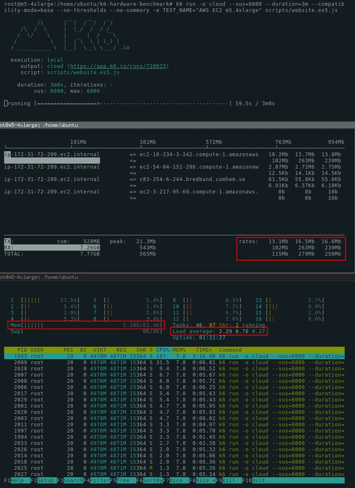

# Running large tests

- 이 문서는 단일 머신에서 대규모 k6 테스트를 어떻게 연동하는지 알려준다. 이때 분산 실행을 설정하지 않고 수행되도록 작성한다. 

- 많은 로드 테스터의 잘못된 공통적인 오해는 대규모 로드를 생성하기 위해서 분산 실행이 필요하다는 것이다. (멀티 머신에서 수행될 수 있어야 쓸만하다는 생각)

- k6에서는 이런 케이스를 고려하지 않는다. 

<br/>

- k6는 하드웨어 리소스를 처리하는 방식에서 많은 다른 부하 테스트 도구와 다르다. 
- 단일 k6 프로세스는 부하 생성기 시스템의 모든 CPU 코어를 효율적으로 사용한다. 
- 단일 인스턴스의 k6는 종종 충분히 동시 vuser를 30,000 ~ 40,000 로드를 생성할 수 있다. 
- VU의 사용자수는 약 300,000 건의 request per second (RPS) 를 생성한다. 

<br/>

- 100,000 - 300,000 을 초당 생성하는 것이 필요하지 않다면 (6-12M 을 분당 요청하고자 하는경우), k6의 단일 인스턴스로 충분하다. 

<br/>

- 우리는 다음에서 다양한 수준의 부하를 생성하는 데 필요한 하드웨어와 고려 사항을 살펴 볼 것이다. 

## OS fine-tuning

- 다음 OS는 full network capacity 를 이용할 수 있도록 설정하여 하나의 서버에서 최대 성능을 낼 수 있다. 

```go
sysctl -w net.ipv4.ip_local_port_range="1024 65535"
sysctl -w net.ipv4.tcp_tw_reuse=1
sysctl -w net.ipv4.tcp_timestamps=1
ulimit -n 250000
```

- net.ipv4.tcp_tw_reuse: 네트워크 커넥션을 재사용 할 수 있도록 지정한다. 
- net.ipv4.tcp_timestamps: - net.ipv4.tcp_timestamps: 대규모 네트워크 처리시 패킷의 순서를 타임스탬프로 사용한다. 이렇게 하면 네트워크 패킷 시퀀스의 중복 발생을 제거할 수 있어 대규모 처리에 문제없이 수행된다.
- net.ipv4.ip_local_port_range: 그리고 로컬 포트의 범위를 향상 시킨다. 

<br/>

- 위 변경사항을 적용하기 위해서, 이 커맨드를 복사하고, root 사용자로 수행한 후 k6 를 수행하거나, 운영체제에서 설정 파일을 변경할 필요가 있다. 

<br/>

- 더 상세한 정보를 위해서, macOS 에서 어떻게 수행해야하는 지에 대해서는 "Fine-tuning OS" 아티클을 살펴보자. https://k6.io/docs/misc/fine-tuning-os 참조 

## 하드웨어 고러사항 

### Network

- 머신의 네트워크 트래픽은 대규모 테스트를 수행할때 중요하게 고려해야할 사항이다. 
- 많은 AWS EC2 머신은 1Git/s 연결이 제공되어 k6가 생성할 수 있는 로드의 양을 제한할 수 있다. 
- 테스트를 수행할때 iftop 을 이용하여 터미널에서 실시간 네트워크 트래픽 양을 확인할 수 있다. 
- 트래픽이 1Git/s 로 일정하면 테스트가 네트워크 카드에 의해 제한될 수 있다. 다른 EC2 인스턴스로 업그레이드 하는 것을 고려하라.

### CPU

- 다른 많은 로드테스트 툴과는 다르게 k6는 대규모의 멀티 쓰레드이다. 
- 이는 모든 가능한 CPU코어를 효과적으로 이용한다. 
- CPU의 양은 테스트 파일에 달려 있다. (가끔 호출된 테스트 스크립트)
- 테스트 파일에 상관없이 대규모 테스트에는 상당한 양의 CPU 파워가 필요하다고 가정할 수 있다. 
- 최소 20% 유휴 주기(k6에서 최대 80% 사용, 20% 유휴)를 갖도록 머신 크기를 조정하는 것이 좋다. 
- 만약 k6가 100% 를 로드 생성에 사용한다면 응답을 올바르게 수신하기 위한 충분한 CPU가 없다는 것이다. 
- 이로 인해 결과 메트릭이 실제보다 훨씬 더 긴 응답 시간을 가질 수 있다. 

### Memory

- k6는 메모리를 좋아한다. 그러나 다른 부하테스트 도구들 처럼 메모리를 탐욕하지는 않는다. https://k6.io/blog/comparing-best-open-source-load-testing-tools#memory-usage
- 메모리는 테스트 시나리오에 따라 소비량이 크게 달라진다. 
- 테스트의 필요 메모리를 산정하기 위해서 개발 머신에서 테스트를 100VU 로 수행하고 VU의 대상 수에 따라 소비되는 메모리량을 곱해주면 된다. 
- 가장 단순한 테스트는 ~1-5MB를 VU당 소비하는 것이다. (1000Vus = 1-5GB)
- 테스트들은 각 VU당 10메가를 소비하여 파일 업로드에 이용할 것이다. 

## General advice

### 테스트 코드를 탄력적으로 만들어라. 

- 대규모 스트레스 테스트를 수행할때 스크립트는 HTTP 응답에 대해서 아무것도 가정할 수 없다. 
- 종종 성능 테스트는 "행복한 경로"를 염두에 두고 작성된다. 
- 예를 들어 "happy path" 검사는 k6에서 자주 볼 수 있다. 

```js
import { check } from 'k6';
import http from 'k6/http';

const res = http.get('https://test.k6.io');
const checkRes = check(res, {
  'Homepage body size is 11026 bytes': (r) => r.body.length === 11026,
});

```

- 이러한 코드는 테스트 중인 시스템(Sistem Under Test) 이 과부하 되지 않고 적절한 응답을 반환할 때 제대로 실행된다. 
- 시스템이 실패하기 시작하면 위의 검사가 예상대로 동작하지 않는다. 

- 여기서 문제는 검사가 응답에 항상 컨텐츠가 있다고 가정한다는 것이다. 
- 만약 실패한다면 r.body 가 존재하지 않을 것이다. 
- 이러한 케이스에서 check는 정상적으로 동작하지 않고, 아래와 같은 결과를 반환할 것이다. 

```js
ERRO[0625] TypeError: Cannot read property 'length' of undefined
```

- 이 이슈를 수정하기 위해서 체크는 반드시 어떠한 응답에도 탄력적으로 수행될 수 있도록 수정되어야한다. 
- 다음이 그 수정 내용이다. 

```js
import { check } from 'k6';
import http from 'k6/http';

const res = http.get('https://test.k6.io');
const checkRes = check(res, {
  'Homepage body size is 11026 bytes': (r) => r.body && r.body.length === 11026,
});

```

### load 생성 서버를 모니터하기

- 만약 첫번째 테스트를 수행하고자 한다면, 테스트가 실행되는 동안 사용 가능한 리소스를 주시하는 것이 좋다. 
- 이를 위해 3개의 세션으로 서버에 SSH 연결하는 것이다 .
  - K6를 수행하기 위한 접속
  - CPU, Memory 모니터링을 위한 접속
  - Network 를 모니터링 하기 위한 접속 

- CPU와 메모리 모니터링을 위해서 htop을 추천한다. 
- 네트워크 모니터링을 위해서는 iftop 을 추천한다. 

- 다음은 k6, iftop 및 htop 을 보여주는 3개의 터미널 세션 스크린샷이다. 



## k6 옵션

- k6는 대규모 테스트를 수행할 때 추가적인 성능 이점을 해제할 수 있도록 해준다. 

### --compatibility-mode=base

- 가장 영향을 크게주는 옵션으로 k6 성능을 향상하기 위한 옵션이며, --compatibility-mode=base 로 설정하여 내부 Babel 변환을 비활성화 하고 ES5.1로 작성된 k6 스크립트를 실행하는 것이다. 

```go
# compatibility-mode=base disables the Babel transpilation and the inclusion of corejs 
$ k6 run --compatibility-mode=base yourscript.es5.js
```

- Background (배경)
  - K6스크립트 예제의 대부분과 문서는 ES6+ 로 작성되었다. 
  - 기본적으로 k6는 ES6+ 코드를 변환하여 ES5.1 로 작성하여 babel을 이용한다. 그리고 공통적으로 사용하는 API르 ㄹ활성화 하기 위해서 corejs 를 로드한다. 
  - 이 작업은 유스케이스의 99%에 매우 잘 동작한다. 그러나 대규모 테스트에서는 상당한 양의 코드를 추가하게 된다. 
  - ES5.1 스크립트를 원래 ES6+ 대신에 수행하면 k6는 50-85% 의 메모리를 사용할 수 있으며, CPU 로드 타임의 상당량을 줄이고, 시작시간을 줄여준다. 

- k6의 외부 스크립트를 변환하기 위해 webpack을 사용할 수 있다. 
- ES6+ 코드를 k6용 ES5.1 코드로 변환하는 webpack.config 예제를 준비했다. https://github.com/grafana/k6-hardware-benchmark/blob/master/webpack.config.js
- k6-hardware-benchmark 리포지토리에서 다음 코드를 쓸수 있다. 

```js
$ git clone https://github.com/grafana/k6-hardware-benchmark/
$ cd k6-hardware-benchmark
$ yarn install

$ yarn run to-es5 someplace/yourscript.js
# builds the ES5 script in someplace/yourscript.es5.js

$ k6 run --compatibility-mode=base someplace/yourscript.es5.js

```

###  discardResponseBodies

- 다음과 같이 options 객체에 discardResponseBodies를 설정하여 응답 본문을 처리하지 않도록 k6에 지시할 수 있다. 

```js
export const options = {
  discardResponseBodies: true,
};
```

- k6는 기본적으로 요청의 응답 본문을 메모리에 로드한다. 
- 이것은 훨씬 더 많은 메모리 소비를 유발하며 종종 완전히 불필요하다. 
- 만약 몇몇 요청에 대해서 응답 바디가 필요한 경우라면 Params.responseType 를 설정한다. https://k6.io/docs/javascript-api/k6-http/params

### --no-thresholds --no-summary

- 만약 로컬 테스트를 수행하고자 한다면 그리고 결과를 클라우드로 스트리밍 한다면 (k6 run -o cloud)를 이용하는 경우라면 터미널 summary 를 disable 하길 원할 것이다. 이는 임계값과 요약이 클라우드에 표시되므로 비활성화가 가능하다. 

- 이를 통해서 메모리와 CPU의 사이클을 save 할 것이다.

- 다음은 이야기한 모든 플래그를 사용한 예이다. 

```go
k6 run scripts/website.es5.js \
  -o cloud \
  --vus=20000 \
  --duration=10m \
  --compatibility-mode=base \
  --no-thresholds \
  --no-summary \

```

### 불필요한 검사, 그룹, 커스텀 메트릭 제거하기

- 만약 다른 모든것이 실패하고 하드웨어에서 더 많은 성능을 끌어내려고 하는 경우 부하 테스트 자체의 코드 최적화를 고려할 수 있다. 

#### Checks and groups

- k6는 모든 개별 점검 및 그룹의 결과를 별도로 기록한다. 
- 많은 검사 및 그룹을 사용하는 경우 성능 향상을 위해 제거를 고려할 수 있다. 

#### Custom metrics

- check와 유사하게 커스텀 메트릭의 값(Trend, Counter, Gauge 그리고 Rate) 들은 분리 저장된다. 
- 커스텀 메트릭의 사용을 최소화를 고려하라. 

#### Thresholds with abortOnFail

- abortOnFail 쓰레시홀드를 설정했다면, k6는 지속적으로 임계값을 초과하지 않았는지 평가해야한다. 
- 이 설정을 삭제하라. 

### File upload testing

- 파일 업로드를 테스트할 때는 특별한 고려 사항을 취해야한다. 

#### Network throughput

- 로드 생성 머신에서 네트워크 처리량과 SUT가 병목 현상이 될 수 있다. 

#### Memory

- k6는 모든 VU가 독립적이고 자체 메모리를 가지고 있기 때문에 파일을 업로드할 때 상당한 양의 메모리가 필요하다. 

#### Data transfer costs

- k6는 짧은 시간에 많은 양의 데이터를 업로드 할 수 있다. 
- 대규모 테스트를 시작하기 전에 데이터 전송 비용을 이해해야한다. 
- 아웃바운드 데이터 전송은 AWS EC2에서 비용이 많이 든다. https://www.cloudmanagementinsider.com/data-transfer-costs-everything-you-need-to-know/
- 가격 범위는 지역에 따라 GB당 $0.08 ~ $0.20 이다. 
- 가장 저렴한 지역을 사용하는 경우 비용은 GB당 $0.08이다. 
- 따라서 1TB 업로드 하는 비용은 약 $80이다.
- 장기 실행 테스트는 데이터 전송에만 수백달러의 비용이 들 수 있다. 

#### EC2 비용

- AWS EC2는 비교적 저렴하다. 
- 이 벤치마크에서 사용한 가장 큰 인스턴스(m5.24xlarge)도 시간당 $4.6 dlek.
- 테스트가 끝나면 부하 생성기 서버를 꺼야한다. 
- Forgotten EC2 서버는 한달에 $3312 이다. 
- 팁: 비용의 10-20%로 동일한 하드웨어의 "스팟 인스턴스"를 시작하는 것이 종종 가능하다. 

### Errors

- 실행중에 오류가 발생하면 부하 생성기 또는 실패한 SUT로 인해 발생했는지 이해하는 것이 필요하다. 

#### read: connection reset by peer

- 이와 유사한 오류는 대상 시스템이 TCP 연결을 재 설정하기 때문에 발생한다. 
- 이는 로드 밸런서 또는 서버 자체가 트래픽을 처리할 수 없을때 발생한다. 

```go
WARN[0013] Request Failed       error="Get http://test.k6.io: read tcp 172.31.72.209:35288->63.32.205.136:80: read: connection reset by peer"
```

#### context deadline exceeded

- 이와 유사한 오류는 k6가 요청을 보낼수 있었으나, 대상 시스템이 제때 응답하지 못한 경우이다. 
- 기본 타임아웃은 k6에서 60초이다. 
- 만약 시스템이 이 타임 프레임에서 응답을 생성하지 못하면 에러가 발생하게 된다. 

```go
WARN[0064] Request Failed    error="Get http://test.k6.io: context deadline exceeded"
```

#### dial tcp 52.18.24.222:80: i/o timeout

- 이와 비슷한 오류인데 이 경우 k6은 요청조차 하지 못한경우이다. 
- 대상 시스템이 연결을 설정할 수 없다. 

```go
WARN[0057] Request Failed     error="Get http://pawel.staging.loadimpact.com/static/logo.svg?url=v3: dial tcp 52.18.24.222:80: i/o timeout"
```

#### socket: too many open files

- 이 오류는 로드 생성기 시스템이 열린 파일 설명자의 한계에 도달했기 때문에 TCP 소켓을 열 수 없음을 의미한다. 
- 파일 핸들러를 충분히 높게 설정되었는지 확인하라. ulimit -n 250000은 누구에게나 충분하다. 

```go
WARN[0034] Request Failed     error="Get http://99.81.83.131/static/logo.svg?ip=6: dial tcp 99.81.83.131:80: socket: too many open files"
```

- 노트: 수용가능한 에러 레벨을 정의해야한다.
  - 대규모에서 몇몇 에러는 항상 발생한다. 
  - 만약 50M의 요청중에 100개의 오류는 일반적으로는 좋은 결과이다. (0.00002% 에러들)

### Benchmarking k6 on AWS

- k6이 생성할 수 있는 부하의 양을 확인하기 위해 여러 EC2 시스템에서 몇 가지 대규모 테스트를 실행했다. 
- 일반적인 관찰은 k6가 하드웨어에 비례하여 확장된다는 것이다. 
- 2배 더 큰 시스템은 2배 더 많은 트래픽을 생성할 수 있다. 
- 이 확장성의 한계는 열린 연결 수에 있다.
- 단일 Linux 시스템은 IP당 최대 65,535 소켓을 열 수 있다. 
- 이는 단일 시스템에서 최대 65,000 개의 요청을 동시에 실행할 수 있음을 의미한다. 
- RPS 제한은 SUT의 응답시간을 기반으로 한다. 
- 만약 응답이 100ms에 도달하는 경우 RPS 제한은 560,000 이다. 

#### Real-life test of a website.

- 이론적 한계를 테스트하는 것은 재미있지만 이 벤치마크의 요지는 그것이 아니다. 
- 이 벤치마크의 요점은 복잡한 실제 테스트를 실행할 때 k6이 생성할 수 있는 트래픽의 양을 사용자에게 표시하는 것이다. 
- 이를 위해 거의 모든 k6 기능을 사용하는 다소 무거운 실제 웹 사이트 테스트를 작성했다. 
- Setup:
  - 모든 테스트들은 AWS EC2 인스턴스에서 수행되었다. 
  - "discardResponseBodies" 를 추천은 사용되지 않았다. (세팅하면 결과는 더 좋다.)
  - 스크립트들은 테스트를 위해서 사용하며 /scripts 디렉토리있다. 결과들은 재생산가능하다. 
  - k6 v0.26.2 가 사용되었다. 
  - 노트: 대상시스템(test.k6.io)는 부스트 퍼포먼스를 위해서 대규모 클러스터에서 실행되었다. 
  - 노트: 대상시스템(test.k6.io)는 PHP 웹사이트이며, 최적화되지 않았고, 정적 웹사이트가 훨씬 빠르다.

- "website.js" 테스트 파일은 광범위한 k6 기능을 사용하여 테스트가 k6의 실제 사용을 에뮬레이트하도록 한다. 
- 이것은 성능을 위해 조작된 테스트가 아니다. 정반대이다.
- 이 테스트는 몇몇 커스텀 메트릭, checks, parameterization, batches, thresholds, groups 등을 이용하였다. 
- 이는 실제 사용 케이스를 잘 표현하는 헤비 테스트이다. 

#### > AWS m5.large EC2 server

- m5.large 인스턴스는 8GB램, 2 CPU코어이다.
- 다음 명령을 이용하여 수행되었다. 

```go
$ k6 run scripts/website.es5.js \
 -o cloud \
 --vus=6000 \
 --duration=10m \
 --compatibility-mode=base \
 --no-thresholds \
 --no-summary
```

- 결과:
  - 최대 vuser는 6000 
  - 메모리 사용: 6.09 GB (8.0 GB 중)
  - CPU 로드(평균): 1.49 (2.0 중)
  - Peak RPS: ~6000 (노트, 이 테스트는 RPS에 대해서 최적화 되지 않았다.)
  - 2x sleep(5) 매번 슬립한다. 

#### > AWS m5.4xlarge

- m5.4xlarge 인스턴스는 64GB 랩과 16 CPU 코어이다. 

```go
k6 run scripts/website.es5.js \
   -o cloud  \
   --vus=20000 \
   --duration=10m \
   --compatibility-mode=base  \
   --no-thresholds  \
   --no-summary
```

- 결과
  - 최대 VUser: 20,000
  - 메모리: 20.1GB (최대 61.4)
  - CPU 로드(평균): 8.5 (최대 16.0)
  - Peak RPS: ~ 20,000 (노트, 이 테스트는 RPS를 위해 최적화 되지 않음)
  - 2x sleep(5) 매번 슬립한다. 

#### > AWS m5.24xlarge

- m5.24xlarge 는 384GB의 램, 96 CPU 코어를 가진다. 
- 노트: 슬립은 5초에서 1초로 줄였다. 더 많은 리퀘스트를 만들어 내기 위해 작업했다. 

```go
k6 run scripts/website.es5.js  \
   -o cloud  \
   --vus=30000 \
   --duration=5m \
   --compatibility-mode=base  \
   --no-thresholds  \
   --no-summary

```

- 결과
  - 최대 VUser: 30,000
  - 메모리: ~120GB (최대 370)
  - CPU load(평균): ~45 (최대 96.0)
  - Peak RPS: ~61,500
  - sleep(1) 매번 슬립


### Testing for RPS

- 처음 언급했듯이 k6은 특히 대상 시스템이 빠르게 응답하는 경우 많은 요청을 매우 빠르게 생성할 수 있다. 
- 앱의 RPS 제한을 테스트하기 위해 RPS 최적화 테스트를 작성했다. 
- 불행하게도 test.k6.io 대상 시스템은 다소 느린 PHP 앱이다.
- 그럼에도 불구하고 30k VU 를 사용하여 188,000 RPS 에 도달했다. 
- 더 빠른 시스템의 경우 훨씬 더 높은 숫자가 가능하다. 

#### > AWS m5.24xlarge

```go
k6 run scripts/RPS-optimized.es5.js \
   -o cloud  \
   --vus=30000  \
   --duration=1m  \
   --compatibility-mode=base  \
   --no-thresholds \
   --no-summary

```

- 결과
  - 최대 vuser: 30,000
  - 메모리: 25GB(370 최대)
  - CPU load(평균): 80 (최대 96)
  - Peak RPS: ~188,500

### Testing for data transfer

- k6은 파일을 업로드 할 때 사용 가능한 네트워크 대역 폭을 활용할 수 있지만 그렇게 하려면 만은 메모리가 필요하다. 
- 대규모 테스트를 시작하기 전에 AWS의 데이터 전송 비용에 대한 경고를 읽어라. 

#### > AWS m5.24xlarge

- 넽워크 처리량을 테스트 하기 위해 파일 업로드 스크립트를 작성했다.
- 데이터 전송 비용을 최소화 하기 위해 이 테스트를 1분 동안만 수행했다. 
- 1분만에 k6은 1000VU로 36GB의 데이터를 전송했다. 

```go
k6 run scripts/file-upload.es5.js \
-o cloud \
--vus=1000 \
--duration=1m \
--compatibility-mode=base \
--no-thresholds \
--no-summary

```

- 결과
  - 최대 vUser: 1,000
  - 메모리: 81GB (최대 370)
  - CPU load(평균): 9 (최대 96)
  - 네트워크 처리량: 4.7Gbit/s
  - 데이터 전송: 36GB

- 노트: 
  - 각 VU 는 완벽히 독립적이다. 그러므로 다른 VU끼리 어떠한 메모리도 공유하지 않는다. 
  - 1000VU는 26MB 파일을 업로드 하기 위해서 각 VU메모리는 81GB의 램이 필요하다. 

### Distributed execution

- 부하 테스트에서 분산 실행은 여러 컴퓨터에 분산된 부하 테스트를 실행하는 것을 의미한다. 
- 사용자는 종종 대규모 테스트를 실행하기 위해 분산 실행 모드를 찾는다. 
- 단일 k6 인스턴스가 엄청난 로드를 생성할 수 있음을 보여주었지만 다음을 위해서는 분산 실행이 필요하다. 
  - 여러 위치에서 동시에 부하를 시뮬레이션한다.
  - 단일 기계가 처리할 수 있는 것 이상으로 테스트 부하를 확장한다. 
- k6에서는 실행 세그먼트 옵션을 사용하여 여러 k6인스턴스에 테스트 부하를 분할할 수 있다. 

#### 2개 머신

```go
## split the load of my-script.js across two machines
k6 run --execution-segment "0:1/2"   --execution-segment-sequence "0,1/2,1" my-script.js
k6 run --execution-segment "1/2:1"   --execution-segment-sequence "0,1/2,1" my-script.js
```

#### 3개 머신

```go
## split the load of my-script.js across three machines
k6 run --execution-segment "0:1/3"   --execution-segment-sequence "0,1/3,2/3,1" my-script.js
k6 run --execution-segment "1/3:2/3" --execution-segment-sequence "0,1/3,2/3,1" my-script.js
k6 run --execution-segment "2/3:1"   --execution-segment-sequence "0,1/3,2/3,1" my-script.js

```

#### 4개 머신

```go
## split the load of my-script.js across four machines
k6 run --execution-segment "0:1/4"     --execution-segment-sequence "0,1/4,2/4,3/4,1" my-script.js
k6 run --execution-segment "1/4:2/4"   --execution-segment-sequence "0,1/4,2/4,3/4,1" my-script.js
k6 run --execution-segment "2/4:3/4"   --execution-segment-sequence "0,1/4,2/4,3/4,1" my-script.js
k6 run --execution-segment "3/4:1"     --execution-segment-sequence "0,1/4,2/4,3/4,1" my-script.js

```

- 그러나 이 순간 분산 실행 모드는 전체적으로 동작하지 않는다. 
- 현재 제한은 다음과 같다. 
  - k6은 테스트의 분산 실행을 조정하기 위한 코디네이터 또는 마스터 인스턴스를 제공하지 않는다. 그리고 k6 REST API및 --paused를 사용하여 여러 k6인스턴스의 실행을 동기화 할 수 있다. 
  - 각 k6 인스턴스는 다른 k6인스턴스의 결과를 제외하고 독립적으로 임계값을 평가한다. 임계값 실행을 비활성화 하려면 --no-thresholds 를 사용하라. 
  - k6 은 각 인스턴스에 대해 개별적으로 메트릭을 보고한다. 부하테스트 결과를 저장하는 방법에 따라 올바르게 계산하려면 일부 메트릭을 집계해야한다. 

- 위 제한으로 k8s 클러스터 전체에 k6 테스트 부하를 분산하는 Kubernetes 운영자를 구축했다. 자세한 지침은 이 튜토리얼을 확인하세요

<br/>
- k6 목표는 분산 실행을 위한 기본 오픈 소스 솔루션을 지원하는 것이다. 
- 진행상황을 따르려면 GitHub에서 분산 실행 문제를 구독하라. 

## Large-scale tests in k6 Cloud

- k6 클라우드 상용 제품은 다른 이점 중에서도 대규모 테스트를 실행하기 위한 즉각적인 솔루션을 제공한다. 
- 어떤 솔루션(OSS 또는 클라우드)이 프로젝트에 더 적합한지 확실하지 않은 경우 이 백서를 읽고 확장 가능한 솔루션을 구축할 때 고려해야 할 위험과 기능에 대해 자세히 알아보는 것이 좋다. 

## 더 읽어볼것

- Fine tuning OS
  - https://k6.io/docs/misc/fine-tuning-os
- JavaScript Compatibility Mode
  - https://k6.io/docs/using-k6/javascript-compatibility-mode
- A biased comparison of the best open source load testing tools
  - https://k6.io/blog/comparing-best-open-source-load-testing-tools
- k6 Cloud Pricing - soak and large-scale tests
  - https://k6.io/pricing#larger-tests
- White paper: what to consider when building or buying a load testing solution
  - https://k6.io/what-to-consider-when-building-or-buying-a-load-testing-solution

