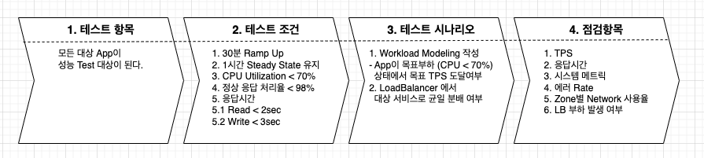

# 성능 Test와 K6 도구 소개

## 1. 성능 테스트 이해하기

- 성능테스트란 특정 워크로드에서 소프트웨어의 응답시간, 안정성, 확장성, 가용성, 리소스 사용량등을 테스트 하여 고객에게 소프트웨어 가치를 최대로 전달할 수 있는지를 측정하는 행위이다. 

--- 

- 응답시간: 사용자의 요청으로 부터 결과를 반환하기 까지 시간
- 안정성: 워크로드가 다양한 문제 상황에서도 일정한 쿼리티의 제품을 고객에게 제공할 수 있도록 안정적으로 운영되는지 여부
- 확장성: 워크로드에 부하 혹은 시스템의 용량이 임계치에 도달한경우 시스템을 수직 혹은 수평으로 확장하여 일정한 서비스의 품질을 유지할 수 있는지 여부
- 가용성: 물리적 장애, 어플리케이션의 부하등이 발생 했을때에도, 퀄리티를 유지하면서 고객에게 서비스를 제공하는지 여부

## 성능 테스트를 수행으로 알게 되는것

1. 예상 목표 TPS를 달성하는가?
2. 피크 시간에서 원활하게 서비스 할 수 있는가?
3. 오랜시간 서비스를 수행하더라도 자원의 누수 없이 서비스를 수행할 수 있는가?
4. 사람이 더 많이 들어오는 경우 수평/수직 확장을 하기 위한 기준은 무엇인가?
5. 일부 시스템이 다운되어도 서비스를 적절히 수행할 수 있는 최소 리소스 요건은 어떻게 되는가?
6. 시스템 리소스가 오버 프로비저닝 되지 않았는가?
7. 시스템 메트릭은 시스템을 잘 설명하고 있는가?
  
### 성능 Test 이론

### 용어

- Transaction (TX)
  - DB트랜잭션과는 다른 의미로, 논리적인 업무 요청의 단위를 트랜잭션이라고 한다. 
  - 사용자가 한번의 요청을 보내는 단위 요청

---

- 총 사용자 (Total User)
  - $현재 서비스 요청자 + 서비스 대기자 + 비접속자$
- 현재 서비스 요청자 (Active User)
  - 현재 서비스에 요청을 보낸 상태에 있는 사용자
- 서비스 대기자 (InActive User)
  - 서비스에 접속은 하고 있으나 아직 요청을 보내지 않은 사용자
- 동시 사용자 (Concurrency User)
  - $Active User + InActive User$

---

- 처리량
  - 단위 시간당 처리되는 양 (건수)
  - TPS(Transaction Per Second)
  - RPS(Request Per Second)
  - Throughtput(처리량)
- 처리량계산
  - $처리량 = Active User / 평균 응답시간$
- Active User
  - $Active User = 처리량 * 평균 응답시간$
- Request Interval (요청주기)
  - $Request Interval = Response Time (응답시간) + Think time (생각 시간) + Operation time (조작 시간)$
- 응답시간 (Response Time)
  - 사용자가 서버로 요청을 보내후 부터 응답이 오기까지 시간
- 생각 시간 (Think Time)
  - 응답을 받고 화면등을 보면서 생각하는 시간
- 조작 시간 (Operation Time)
  - 작업 요청을 보내기 위해서 데이터를 입력하거나, 화면을 채우는 시간
  - 일반적으로 생각시간에 포함 시킨다. 

### 성능 테스트 과정 



- 테스트 항목
  - 테스트 항목은 현재 테스트를 수행하는 모든 어플리케이션이 대상이다.
  - 모든 대상을 나열하고, 우선 순위에 때라 테스트 범위를 잡는다.
- 테스트 조건
  - 테스트를 수행할때 각 어플리케이션마다 만족해야할 조건을 설정한다. 
  - 30분 RapUp: 부하를 발생할때 30분간 목표 사용자가 접속하도록 램프업을 수행한다. 
  - 1시간 Steady State 유지: 시스템이 목표 사용자가 접속한 상태에서 목표하는 시간동인 유지되면 서비스가 정상으로 운영된다는 가정을 테스트 조건으로 지정한다. 
  - CPU Utilization < 70%: 목표 부하가 들어오는 상태에서 CPU 사용율이 70 이하가 유지되는 조건으로 지정했다.
  - 정상 응답 처리율: 부하가 들어왔을때 목표 시간내 정상적인 응답율이 98%를 달성하는지를 몰표로 잡았다.
  - 응답시간: 목표 평균 응답시간은 읽기/쓰기에 따라 목표 응답 시간을 지정한다. 
- 테스트 시나리오
  - 워크로드 모델을 작성한다. 
    - 워크로드 모델은 모든 요청 경로를 조사하고, 특정기준 80:20 중 80 요청을 테스트 대상 워크로드로 삼는다. 
    - 워크로드마다 목표 TPS를 지정하고 각각의 목표치를 달성하는지를 점검한다.
  - 로드밸런서
    - 로드밸런서의 특징을 파악하고 골고루 대상 시스템에 분배 되는지 여부 파악
    - 로드 밸런서 혹은 라우팅 정책을 시스템에 맞게 지정한다. 
- 점검항목
  - 점검항목은 테스트 담당자가 수집할 수 있는 모든 항목을 점검한다. 
  - TPS, 응답시간(Latency), 시스템메트릭(CPU Util, Mem usage, Network Retransmission ...), 에러율, 네트워크 사용율,  LB부하발생 여부 등이 메트릭 지표가 될 것이다. 

### 성능테스트 Graph


from: https://publib.boulder.ibm.com/httpserv/cookbook/Cookbook_General-Theory.html

- A: 사용자가 증가되는 지점 (RampUp) 
  - 해당 지점동안 사용자가 늘면서 처리량도 함께 증가한다.
- Saturation point: 임계지점(포화지점)
  - 사용자가 증가해도 더이상 처리량은 증가되지 않는 상태가 된다. 
  - 이 상태가 되면 현재 시스템이 처리할 수 있는 최대 Capacity 에 도달했음을 나타낸다. 
- B: 최대 부하 지점
  - 사용자가 증가해도 처리량이 일정하게 유지되는 지점이다. 
  - 이때 그래프가 고르고 안정적이라면 서비스가 최대 Capacity로 유지될 수 있음을 나타낸다. 
- C: Buckle 영역 (성능 감소지점)
  - 최대 처리를 더이상 견더내지 못하고 성능이 감소되는 지점이다. 
  - 이 시점은 시스템의 한계를 초과 했거나 네트워크 대역폭을 다 써버린 경우에 이런 현상이 발생한다.
### 성능테스트별 그래프

- 성능테스트 방법에 따라 그래프 패턴을 확인할 수 있다. 

#### LoadTest

-  LoadTest는 목표 TPS에 따라 부하를 주입하여 시스템의 평상시 로드를 수용할 수 있는지 확인한다. 


- 위 그래프는 약 9분 3초까지 RampUp 이 수행되고, 이후 09시 13분까지 Load가 주어진다 이후 RampDown이 수행됨을 알 수 있다. 
- 로드 상태에서 일정한 응답을 내보내고 있는지 확인하자. 
- [참고 Load Test](https://k6.io/docs/test-types/load-testing/)

#### Stress Test

- StressTest는 무거운 로드(스트레스) 상태에서도 시스템이 서비스를 정상으로 수행할 수 있는지 파악하는 목적으로 사용된다. 
- 즉, 시스템의 안정성을 측정하는 용도이다.
- 앞으로 소개될 K6에서는 ramping-arrival-rate 을 이용하여 스트레스 상황을 구현할 수 있다. 
- [참고 Stress Test](https://k6.io/docs/test-types/stress-testing/)

#### Soak Test

- Soak Test는 Endurance Test 라고 하는 오랜기간 부하를 주입하였을때 시스템이 정상적으로 서비스를 수행하는지 확인하기 위한 용도로 사용된다. 
- 이를 통해서 메모리 릭, 잠재적 버그, 요청 누락 등의 예기치 못한 오류를 파악할 수 있다. 
- Soak Test는 시스템의 신뢰도를 측정하기 위한 목적으로 사용된다. 
- [참고 Soak Test](https://k6.io/docs/test-types/soak-testing/)


### 워크로드 모델링

- 워크로드 모델링은 성능 테스트를 수행할 대상 워크로드를 나열하고, 이중 업무 중요도가 높은 순으로 가설을 설정하고 이에 따라 성능 테스트 대상을 설정하는 작업이다.
- 시스템에서 사용하는 워크로드를 모두 나열하고, 여기서 가장 많이 사용되는 80% 혹은 70% 의 워크로드만을 대상으로 잡고 성능 테스트를 수행한다. 

|워크로드| Target TPS| User| Response Time(sec)| Think Time| TPS|
|---|---|---|---|---|---|
|메인화면| 30| 150| 1| 4| 30|
|로그인| 25| 125| 1| 4| 25|
|마이페이지| 14| 70| 3| 2| 14||
|상품| 10| 50| 0.5| 4.5| 10|
|주문| 5| 25| 4| 1| 5|
|결제| 5| 25| 1| 4| 5|
|혜택| 5| 25| 2| 3| 5|
|주문내역| 5| 25| 1| 4| 5|
|Total| 100| | | 100|

- 위 워크로드는 8개의 어플리케이션을 나열하고있다. (실제 모든 워크로드는 이보다 더 많을 것이다. 여기서는 약 80% 정도의 워크로드만 나열하여 모델링 한다.)
- 목표 TPS: 사용자가 기대하는 목표 TPS이다. 
- User: 가상 vUser로 얼마나 많은 사용자가 요청을 할지 가설을 설정한다. 
- Response Time: 응답시간
- Think Time: 생각시간
- TPS: 실게 계산된 값이다. User / (Response Time + Think Time) 으로 계산된다. 

<br/>

- 위와 같은 워크로드 모델을 구성하고, 성능테스트를 진행하여, 전체 워크로드들에 어떻게 부하를 골고루 분산해서 주입할지 결정하게 된다. 

### 성능 테스트 수행 및 도구 

- 다양한 성능 테스트 도구들이 존재한다. 여기서는 오픈소스 성능 테스트만 살펴볼 것이다. 
- nGrinder: 
  - Naver에서 개발하고 오픈소스화 하였다. 
  - 사용이 심플하고, UI, 복수개의 부하 생성기를 구성할 수 있다. 
  - Jython, Groovy 스크립트를 사용하여 부하테스트 시나리오를 작성할 수 있다. 
  - [참고 nGrinder](https://naver.github.io/ngrinder/)
- JMeter:
  - 100% 자바로 개발된 오픈소스 성능 테스트 도구
  - 다양한 통신 프로토콜을 지원한다. 
    - HTTP/HTTPS, SOAP/REST, FTP, DATABASE, LDAP, JMS, SMTP 등등
    - IDE 도구를 이용한 화면기반 테스트 수행가능
    - 풍부한 리포트 기능
    - 멀티 쓰레딩 기반 성능 테스트 수행
    - [참고 JMeter](https://jmeter.apache.org/) 
- Gatling:
  - 오픈소스로 강력한 로드테스팅 솔루션이다. 
  - 지속적인 로드테스트릴 지원하고, 개발 파이프라인에 로드 테스트를 추가할 수 있다. 
  - 웹 레코더를 활용하여 대상 화면에서 쉽게 시나리오를 생성할 수 있다. 
  - 리포트 도구를 제공한다. 
  - Scala, Java, Kotlin 으로 스크립트를 작성할 수 있다. 
  - [참고 Gatling](https://gatling.io/)
- K6:
  - 오픈소스 성능테스트 솔루션이다. 
  - 사용하기가 쉽고, Grafana등과 연동하여 UI를 구성할 수 있다. 
  - CLI툴을 사용하여 성능 테스트를 수행한다. 
  - 로컬 혹은 원격지의 스크립트를 로드하여 테스트 할 수 있다. 
  - Check/Thresholds 를 제공하여 성능 목표를 다양하게 구성할 수 있다. 
  - Python을 이용하여 스크립트를 작성한다. 
  - [참고 K6](https://k6.io/docs/)


## 2. K6

### K6소개

#### 장점

- Grafana 에서 만든 오픈소스 부하생성 도구
- 쉬운 테스트 수행, 개발자 중심의 성능 테스트 가능
- CLI 툴을 이용하여 개발자 friendly API 제공
- 자바 스크립트 ES6 지원 
- 자동화 pipeline 구성 가능

#### 단점

- 브라우저 지원 안됨, cli 도구
- NodeJS 환경에서 수행 안됨

### Quick Start

#### Install K6

- [설치 공십 홈페이지](https://k6.io/docs/get-started/installation/)
- mac 의 경우 brew 를 이용하여 설치 가능

```go
brew install k6
```

- docker로 바로 실행 가능

```go
docker pull grafana/k6
```

#### Quick Start

- first_scripts.json 파일을 다음과 같이 생성 

```json
import http from 'k6/http';
import { sleep } from 'k6';

export default function () {
  http.get('https://test.k6.io');
  sleep(1);
}
```

-  다음으로 실행 

```go
$ k6 run first_scripts.json
```

- 실행 결과

```go

          /\      |‾‾| /‾‾/   /‾‾/   
     /\  /  \     |  |/  /   /  /    
    /  \/    \    |     (   /   ‾‾\  
   /          \   |  |\  \ |  (‾)  | 
  / __________ \  |__| \__\ \_____/ .io

  execution: local
     script: first_scripts.json
     output: -

  scenarios: (100.00%) 1 scenario, 1 max VUs, 10m30s max duration (incl. graceful stop):
           * default: 1 iterations for each of 1 VUs (maxDuration: 10m0s, gracefulStop: 30s)


running (00m01.7s), 0/1 VUs, 1 complete and 0 interrupted iterations
default ✓ [======================================] 1 VUs  00m01.7s/10m0s  1/1 iters, 1 per VU

     data_received..................: 17 kB 9.8 kB/s
     data_sent......................: 438 B 253 B/s
     http_req_blocked...............: avg=522.87ms min=522.87ms med=522.87ms max=522.87ms p(90)=522.87ms p(95)=522.87ms
     http_req_connecting............: avg=203.32ms min=203.32ms med=203.32ms max=203.32ms p(90)=203.32ms p(95)=203.32ms
     http_req_duration..............: avg=207.02ms min=207.02ms med=207.02ms max=207.02ms p(90)=207.02ms p(95)=207.02ms
       { expected_response:true }...: avg=207.02ms min=207.02ms med=207.02ms max=207.02ms p(90)=207.02ms p(95)=207.02ms
     http_req_failed................: 0.00% ✓ 0        ✗ 1  
     http_req_receiving.............: avg=202µs    min=202µs    med=202µs    max=202µs    p(90)=202µs    p(95)=202µs   
     http_req_sending...............: avg=65µs     min=65µs     med=65µs     max=65µs     p(90)=65µs     p(95)=65µs    
     http_req_tls_handshaking.......: avg=292.24ms min=292.24ms med=292.24ms max=292.24ms p(90)=292.24ms p(95)=292.24ms
     http_req_waiting...............: avg=206.75ms min=206.75ms med=206.75ms max=206.75ms p(90)=206.75ms p(95)=206.75ms
     http_reqs......................: 1     0.576949/s
     iteration_duration.............: avg=1.73s    min=1.73s    med=1.73s    max=1.73s    p(90)=1.73s    p(95)=1.73s   
     iterations.....................: 1     0.576949/s
     vus............................: 1     min=1      max=1
     vus_max........................: 1     min=1      max=1
```

- 위 테스트 코드는 http://test.k6.io 에 get 요청을 보내고, 1초 쉬게 된다. 

### K6 기본 이해하기 

0. [기본구조(Lifecycle)](06_test_lifecycle.md)

1. [vuser 이해](00.vuser_number.md)

2. [요청보내기](01_http_requests.md)
3. [Metrics 이해하기](02_metrics.md)
4. Check와 Threshold
   1. [Check](03_check.md)
   2. [Threshold](04_threshold.md)
5. [Option 절](05_options.md)
6. [Tag_groups](08_tags_groups.md)
7. [Cookies](09_cookies.md)
8. [환경변수](10_environment.md)

### 시나리오 소개 

- K6는 다양한 테스트 환경을 지원하기 위해 시나리오라는 개념을 두고 있다. 
- 워크로드 모델에서 워크로드에 맞는 시나리오를 통해 성능테스트를 다양하게 수행할 수 있다. 

1. [시나리오소개](11_00_senarios.md)
2. [shared_iterator](11_01_executor_shared_iterator.md)
3. [per_vu_iterations](11_02_per_vu_iterations.md)
4. [constant_vus](11_03_constant_vus.md)
5. [ramping_vus](11_04_ramping_vus.md)
6. [constant_arrival_rate](11_05_constant_arrival_rate.md)
7. [ramping_arrival_rate](11_06_raminpg_arrive_rate.md)

### 워크로드 모델 적용하기 

- 멀티 워크로드를 적용하기 위한 방법 

### 시각화

#### influxdb/Grafana Docker 실행 

[philhawthorne컨테이너](https://hub.docker.com/r/philhawthorne/docker-influxdb-grafana)

```go
docker run -d \
  --name docker-influxdb-grafana \
  -p 3003:3003 \
  -p 3004:8083 \
  -p 8086:8086 \
  -v /Users/1111489/Documents/80.DATAS/influxdb:/var/lib/influxdb \
  -v /Users/1111489/Documents/80.DATAS/grafana:/var/lib/grafana \
  philhawthorne/docker-influxdb-grafana:latest
```

#### k6 실행

[K6 출력연동](https://k6.io/docs/get-started/results-output/)

```go
k6 run first_scripts.json --out json=result_k6.json --out influxdb=http://localhost:8086/k6
```

#### Grafana 연동 및 Dashboard

- Grafana에서 DataSource를 선택한다. 
  - HTTP
    - URL: http://localhost:8086
  - InfluxDB Details
    - Database: k6

- 대시보드 설정 (아래 경로 참조)
  - 대시보드 ID를 복사하고, Grafana에서 import 한다. 

[대시보드](https://grafana.com/grafana/dashboards/10660-k6-load-testing-results/?tab=revisions) 

  

### K6 한계점 및 튜닝

- k6는 단일 머신에서 1개의 프로세스로만 수행되는 단점이 있다. 
- 즉, OS 튜닝에 따라 대량의 부하를 발생할 수 있느냐가 결정된다. 

[OS튜닝](14_os_fine_tuning.md)

[대규모 테스트](90_running_large_test.md)

## WrapUp and QnA

- 성능 이론에 대해서 알아보았고, 성능이론에 사용되는 다양한 용어를 살펴 보았다.
- K6 에 대한 전반적인 기능에 대해서 살펴 보았고, 이를 실행하는 방법에 대해서 이해해 보았다. 
- K6의 한계 그리고 최대한 장비의 이점을 활용한 로드 생성기 구성에 대해서 살펴 보았다. 
- 시각화를 통해 좀더 쉬운 방법으로 결과를 파악하는 법도 알아 보았다. 

### QnA

- wjpark91 님
  
```json
1. 거래 호출 간 사용자 Think Time 은 어떤 기준으로 설정하는지?

2. Kube 환경에서 Pod Scale-out 테스트를 위해 특화된 기능이 있을지? (Scale-out 시 문제점 파악?)
```

- tkakcy159 님

```json
K6는 Grafana labs 에서 만든만큼 Grafana 생태계와의 시너지가 기대되는데요.

1. 다른 부하테스트 도구들과 비교하여 어떤 장점이 있는지(그리고 Grafana 생태계의 타 시스템들과 어떤 시너지가 있는지?)

https://testguild.com/load-testing-tools/ 

- JMeter: 6k stars
- Taurus: 1.7k stars
- Locust: 15.7k stars
- nGrinder: 1.3k stars 
- gatling: 5.1k stars
- k6: 11.7k stars
- Tsung: 2.1k stars
- Siege: 4k stars

2. 부하 테스트 과정과 결과를 시각화할 수 있는지, 그 구성 과정이 간편한지가 궁금합니다!

- nGrinder, jMeter 등은 부하 테스트 결과를 직접 UI로 확인 가능
- k6는 influxDB, Grafana 등을 구성해야함 (간편함에서는 UI가 직접 있는 것이 편함, 하지만 K6는 커맨드라인으로 가능하므로 CI/CD 툴에서 최적화 가능)
```

- sboat123 님

```json
성능테스트 하면 인프라측면도 있고 네트웍 측면도 있고 어플이케이션 측면도 다 고려해야 하는데 이 모든
측면에 대한 성능을 모두 측정 가능한지 궁금하고 또 사용이 얼마나 쉬운지 GUI기반으로 사용이 간편한지도 궁금합니다. 마지막으로 앱개발후 스트레스 테스트환경 구측하는데도 어려움이 많은 데 K6를 사용하면 이 부하테스트 환경도 쉽게 구축이 가능한지요 ?

- 성능 테스트는 2가지 영역으로 나누어짐
- 1. 부하 생성기
  - k6는 부하 생성기로 부하를 생성하고, 응답으로 돌아오기 까지 시간을 측정
  - 또한 요청후 정상/비정상 응답을 집계하여 보여주는 역할을 함
- 2. 모니터링 
  - 모니터링은 서버사이드에 존재하는 어플리케이션, 인프라에 대한 성능을 모니터링 하는 것
  - 보통 이것은 모니터링 시스템을 자체 구축하거나, 오픈소스 모니터링 도구 설치, 유료 모니터링 도구 이용 하는 방법이 존재
  - AWS를 이용한다면 Cloud Watch 등을 활용하여 인프라 모니터링을 수행
  - IT회의의 경우 유료 소프트웨어 Datadog 등과 같은 도구를 사용하여 메트릭을 수집하고 모니터링 하게 됨 
```

- prussianck 님

```json
다른 경쟁사 대비 k6 점유율은 어느정도 이고, 점유율 성장세는 어떠한지 궁금합니다

- 워낙 많은 성능 테스트 도구가 있어서 점유율은 확인하지 못하였음
- 다만 github에 stars 를 바탕으로 인기를 확인할 수 있을듯

https://testguild.com/load-testing-tools/ 

- JMeter: 6k stars
- Taurus: 1.7k stars
- Locust: 15.7k stars
- nGrinder: 1.3k stars 
- gatling: 5.1k stars
- k6: 11.7k stars
- Tsung: 2.1k stars
- Siege: 4k stars

```

- j4k010 님

```json
k6를 들어보긴 했는데 막상 도입해서 사용해보려고 하면 어떤식으로 사용해야될지 잘 모르겠습니다. 성능 테스트를 하는 다른 도구와 비교했을 때 장점은 무엇이있을까요?
```